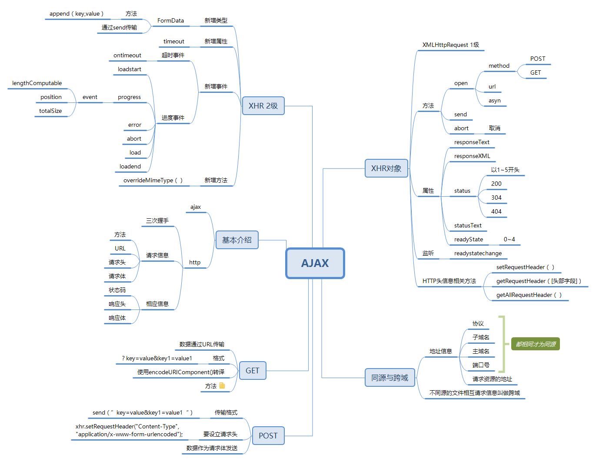
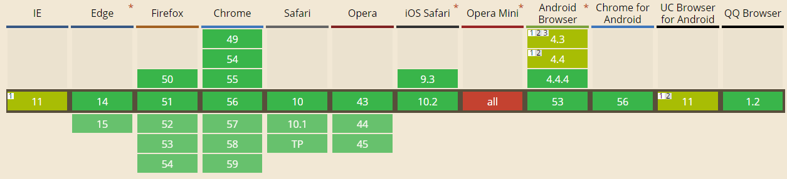

# Learn JavaScript

## 21. Ajax 和 Coment



### 21.1 基本介绍

#### Ajax -- Asynchronous JavaScript + XML

- Ajax 的核心是 XMLHttpRequest 对象，原理：通过 XMLHttpRequest 提供的接口，通过异步的方式从服务器中取得更多的信息，也就是意味着当用户无需重新加载页面就可以取得新的数据，然后通过DOM将新的数据插入到页面中；

#### HTTP -- 用于向服务端请求数据的一种无状态协议

在http 请求的过程中，是通过 TCP 进行连接的，

步骤：

1. 建立TCP连接，
2. 客户端向服务器发送请求命令
3. 客户端向服务器发送请求头
4. 服务器应答
5. 服务器向客户端发送应答信息
6. 服务器想客户端发送数据
7. 关闭TCP

这种建立连接的方式也叫作 TCP 三次握手：

1. 客户端向服务器发送信息，然后等待服务器确认
2. 服务器接收到客户端的请求信息，然后确认信息，同时向客户端发送自己的信息，然后服务器等待客户端的数据
3. 客户端接收到服务器的返回的信息，想服务器发送确认包，发送完毕后TCP就链接成功，完成三次握手

[TCP-三次握手 百度百科](http://baike.baidu.com/item/%E4%B8%89%E6%AC%A1%E6%8F%A1%E6%89%8B?fr=aladdin#1_1)
在完成三次握手以后 客户端就可以向服务端传输数据

在HTTP请求的中包含以下信息：

1. 请求方法；(GET || POST);
2. 请求的URL；
3. 请求头；
4. 请求体；

在HTTP响应的时候包含以下信息：

1. 1个数字和文字组成的状态码，比如：200 ok
2. 响应头（包含很多有用的信息，比如：服务器类型、日期时间、内容类型和长度等）
3. 响应体（响应的正文）

### 21.2 XMLHttpRequest 对象 -- 简称 XHR

首先 IE7+ 以及标准浏览器才会支持原生的 XMLHttpRequest 对象，在之前的IE中需要做兼用处理，这里不做介绍，如果需要兼容可以使用 jQ 或者 查看高程--P572；

如果需要使用，首选要构建一个XML的实例

`var xhr = new XMLHttpRequest`

#### 12.2.1 XHR 的用法

#### 1. 两个方法： open() || send()

#### 基本信息

参数：

1. 发送请求的类型 post || get
2. 请求的 URL __相对路径__
3. 布尔值，表示是否异步发送请求的布尔值

实例：
`xhr.open('post', 'example.txt', false)`

如果仅仅使用open并不会真正的发送请求，而只是启动一个请求的以备发送；
如果需要发送请求，就需要使用 send();
send接受一个参数，作为请求主体发送的数据，如果不需要通过请求主题发送数据，就必须传入 null 。

#### get 的使用

GET 请求是最常用的请求类型，__用于向服务器查询某些信息__，必要时，通过将查询的字符串参数追加到URL的末尾，以便将信息发送给服务器，对 XHR 而言，位于传入open()方法的URL末尾的查询字符串，必须使用正确的编码才行，

查询字符串中的每一个参数的名称和值都必须通过  `encodeURICompontent()` 进行编码，然后放到 URL 的末尾，而且所有的 名-值 对，都必须用过 & 分隔开；

```js
    function addURLParam (url, name, value) {
        url += (url.indexOf('?') == -1 ? '?' : '&');
        url += encodeURIComponent(name) + '=' + encodeURIComponent(value);
        return url;
    }
```

#### post 的使用


POST 请求 __通常用于向服务器发送需要储存的数据，__

- post 的请求应该把数据作为请求的主题提交，
- post 的请求主题可以包含非常多的数据，而且格式不限，

使用post 请求的时候，要同时声明请求头，将 Content-Type 头部信息 设置成 表单类型：

```js
    xhr.setRequestHeader("Content-Type", "application/x-www-form-urlencoded");
    // 这是表单数据提交时的内容类型
```

#### post 和 get 特点

1. get 是通过 URL 进行信息的传输的，所以可以保存为标签；但是这种方式同样意味着很多问题：

    - 信息是完全暴露着的，存在较大的安全风险
    - 信息具有长度数量的限制

    所以get方式通常用于获取服务端的信息

2. post 是通过请求体发送信息的，比get方式要安全一些，主要用于修改服务端的信息 

    在使用post进行传输的时候，要为其设置请求头信息(在open之后，send之前)：
    `xhr.setRequestHeader("content-type", "application/x-www-form-urlencoded")`;

3. 在使用 POST 或者 GET 发送请求的时候必须符合同源策略：
    简单的说：就是只能向同一个域中使用相同端口和协议的 URL 发送请求，如果 URL 与启动请求的页面有任何差别，就会引发安全错误；

4. 与GET请求相比，post 请求消耗的资源更多，GET的请求速度更快；

#### 2. XHR 属性：

当请求成功并且收到响应后，响应的数据就会自动填充XHR对象的属性，

1. responseText: 作为响应主体被返回的文本
2. responseXML: 如果返回的是 text/xml || application/xml 这个属性中将保存包含响应数据的 XML DOM 文档
3. status: 响应的HTTP状态码
4. statusText: HTTP 状态说明
5. readyState: 请求 || 响应的当前活动阶段；

当接受到响应的时候，首先要检测 status 已确认响应已成功返回，

#### status--状态码

HTTP状态吗表示网页服务器HTTP响应状态的3位数字代码；
三位数字的第一个数字代表着其类型：

- 1开头：消息类，代表请求已被接受，需要继续处理。返回的信息中仅仅只包含响应头信息，并且以空行结束；
- 2开头：成功类，这一类型的状态码，代表请求已成功被服务器接收、理解、并接受
- 3开头：重定向类，这类状态码代表需要客户端采取进一步的操作才能完成请求。通常，这些状态码用来重定向，后续的请求地址（重定向目标）在本次响应的 Location 域中指明。
- 4开头：请求错误类，表示这类的状态码代表了客户端看起来可能发生了错误，妨碍了服务器的处理；
- 5开头：服务器错误类，表示这类状态码代表了服务器在处理请求的过程中有错误或者异常状态发生

常见的有：

- 200 -- 成功；
- 304 -- 表示请求的资源并没有修改，可以直接使用浏览器中缓存的版本
- 404 -- 未找到

详细的状态码信息可以查看：
[xhr.status](http://baike.baidu.com/link?url=goW8MoYapmZ9dN5NeNWbv2vEPhgzsmJN6pvEkeSjl99OATcHUCifmS-LMH6HI26Pujd_3IIK7k5loxBmKy6qTa3AH7xgEH-KN5XwSFXZYpxZctiJ29ZPUiXOvZd7MXLG#2_3)

示例：

```js
    xhr.open("get", "example.txt", false);

    if ((xhr.status >= 200 && xhr.status < 300) || xhr.status == 304){
        alert(xhr.statusText);
        alert(xhr.responseText);
    } else {
        alert("Request was unsuccessful: " + xhr.status);
    }

    xhr.send(null);
```

需要注意的是：

1. 无论什么类型的数据都会保存到 responseText 中，而对于非 XML 数据来说，responseXML 属性的值将会是 null
2. 不要依赖 status 来决定下一步的操作，不要依赖 statusText

#### readyState

多数情况下我们需要使用异步的Ajax，而在使用异步Ajax的时候，就需要知道，数据的接受的进度，这时就需要使用 __readystatechange事件__ 监听 -- __readyState属性__

属性值：

- 0：未初始化(还没有调用open)
- 1：启动，已经调用open(),但是还没有send();
- 2: 发送，已经调用send(),但是还没有接受到响应；
- 3: 接受，已经接受到部分响应数据；
- 4: 完成，已经接收到所有的响应数据，并且可以在客户端使用；

>注：
必须在open前，启动 readystatechange 监听；

实例：

```js
    var xhr = createXHR();
    xhr.onreadystatechange = function(event){
        if (xhr.readyState == 4){
            if ((xhr.status >= 200 && xhr.status < 300) || xhr.status == 304){
                alert(xhr.responseText);
            } else {
                alert("Request was unsuccessful: " + xhr.status);
            }
        }
    };
    xhr.open("get", "example.txt", true);
    xhr.send(null);
```

在接收到响应之前，通过调用abort()的方法可以取消异步请求 `xhr.abort()` 并且在终止请求以后，还需要解除 XHR 对象的引用；

### 21.3 HTTP 头信息

`setRequestHeader()` || `getRequestHeader([头部字段名称])` || `getAllRequestHeader()`

每一个HTTP请求和相应都会带有相应的头部信息；如果需要设置头信息，需要在open之后，send之前


### 21.4 同源与跨域

一个域名的地址中包含以下信息：

1. 协议
2. 子域名
3. 主域名
4. 端口号
5. 请求资源的地址

例如：
[同源与跨域](./img/同源与跨域.png);

当协议/域名/端口号中有一个不同的时候就是不同源
在不同源的文件之间相互请求的时候就是跨域，在JS中处于安全考虑不允许出现跨域请求，但是跨域又是常见的需求所以出现了许多解决跨域的方法；

### 21.5 XMLHttpRequest 2级

并非所有的浏览器都能够支持 XMLHttpRequest 2



#### 21.5.1 FormData

在现代浏览器中常用的就是表单数据的序列化，在XML2 中定义了一个 FromData 类型；

具有两种使用方式：

```js
var data = new FormData();
data.append(key,value);

var data1 = new FormData(form);
```

这种类型通过 send 发送，并且可以被识别类型，所以不需要再添加请求头
实例：

```js
var xhr = new XMLHttpRequest();
xhr.onreadystatechange = function () {
    if (xhr.readystate === 4) {
        if (200<=xhr.status && xhr.status<300 || xhr.status === 304) {
            alert (xhr.responseText);
        } else {
            alert (xhr.status);
        }
    }
}
xhr.open("POST", "....", true);

var data = new Form(form);

xhr.send(data)
```

>注:
实现表单序列化有很多种方法，可以通过jq 或者自己写一个处理的方法；

#### 21.5.2 超时设定

xhr2 新添加了一个 timeout 属性，表示在请求多久后如果依旧没有得到相应就停止，并且触发 timeout 事件；

需要注意的是在请求终止的时候，xhr.readystate 会变成4，从而触发 onreadystatechange事件，但是在事件内部就不能访问 status 了，建议在这种情况下 使用 try-catch 包裹

实例：

```js
var xhr = new XMLHttpRequest();
xhr.onreadystatechange = function () {
    if (xhr.readystate === 4) {
        try {
            if (200<=xhr.status && xhr.status<300 || xhr.status === 304) {
                alert (xhr.responseText);
            } else {
                alert (xhr.status);
            }
        } catch (ex) {
            alert(ex);
        }
    }
}
xhr.open("POST", "....", true);
xhr.timeout = 10000;
xhr.ontimeout = function (){
    alert('to long')
}
 
var data = new Form(form);

xhr.send(data)
```

#### 21.5.3 overrideMimeType() 方法

overrideMimeType -- 用于重写 XHR 响应的MIME类型；

在服务端返回的头信息中，会注明返回数据的类型，但是如果标明的类型是文本，但是实际返回的类型却是 XML 格式，那么就会导致在 responseXML 中依旧得不到信息；

使用overrideMimeType可以解决这个问题；

`overrideMimeType("text/xml")`


### 21.6 进度事件

有6个进度事件

1. loadstart -- 接受到响应数据的第一个字符的时候触发
2. progress -- 接受期间不断触发
3. error -- 请求发生错误的时候触发
4. abort -- 调用 abort() 的时候触发
5. load -- 接受完成后触发
6. loadend -- 通讯接受的时候触发

#### 21.6.1 load 事件

load 事件的出现是为了 取代 readystatechange 事件；规定中这个事件的事件对象指向 XHR 对象的实例，但是并非所有浏览器都实现了这个行为

实例：

```js
let xhr = new XMLHttpRequest();
xhr.onload = function() {
    if (200 <= xhr.status < 300 || xhr.status === 304) {
        alert(xhr.responseText);
    }
}
xhr.open("GET", "./dome.txt", true);
xhr.send(null);
```

#### 21.6.2 progress 事件

progress 事件会在浏览器接受新数据期间周期性的触发；

在 progress 事件中的事件对象包含：

1. target -- xhr 对象
2. lengthComputable -- 进度信息是否可用的布尔值
3. position -- 表示已经接受的字节数
4. totalSize -- 表示根据相应头 content-length 部分确定的预计字节数。

这个就可以建立一个进度指示器：

```js
var xhr = new XMLHttpRequest();
xhr.onload = function() {
    if (200 <= xhr.status && xhr.status < 300 || xhr.status === 304) {
        alert(xhr.responseText);
    } else {
        alset(xhr.status);
    }
}
xhr.onprogress = function(ev) {
    var divStatus = document.getElementById("status");
    if (ev.lengthComputable) {
        divStatus.innerHTML = 'received' + ev.position + 'of' + event.totalSize + 'bytes';
    }
}
xhr.open('GET', '...', true);
xhr.send(null)
```

