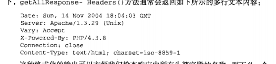

# Learn JavaScript

## 21. Ajax 和 Coment

使用 XMLHttpRequest 对象 || 使用 XMLHttpRequest 事件 || 跨域 Ajax 通信限制

### 21.1 基本介绍

Ajax -- Asynchronous JavaScript + XML 简写，
- Ajax 的核心是 XMLHttpRequest 对象，原理：通过 XMLHttpRequest 提供的接口，通过异步的方式从服务器中取得更多的信息，也就是意味着当用户无需重新加载页面就可以取得新的数据，然后通过DOM将新的数据插入到页面中；

### 21.2 XMLHttpRequest 对象 -- 简称 XHR

首先 IE7+ 以及标准浏览器才会支持原生的 XMLHttpRequest 对象，在之前的IE中需要做兼用处理，这里不做介绍，如果需要兼容可以使用 jQ 或者 查看高程--P572；

如果需要使用，首选要构建一个XML的实例

`var xhr = new XMLHttpRequest`

#### 12.2.1 XHR 的用法

1）open() || send()

参数：
1. 发送请求的类型 post || get
2. 请求的 URL __相对路径__
3. 布尔值，表示是否异步发送请求的布尔值

实例：
`xhr.open('post', 'example.txt', false)`

如果仅仅使用open并不会真正的发送请求，而只是启动一个请求的以备发送；
如果需要发送请求，就需要使用 send();
send接受一个参数，作为请求主体发送的数据，如果不需要通过请求主题发送数据，就必须传入 null 。

>注：
只能向同一个域中使用相同端口和协议的 URL 发送请求，如果 URL 与启动请求的页面有任何差别，就会引发安全错误；

3）XHR 属性：

当请求成功并且收到响应后，响应的数据就会自动填充XHR对象的属性，

1. responseText: 作为响应主体被返回的文本
2. responseXML: 如果返回的是 text/xml || application/xml 这个属性中将保存包含响应数据的 XML DOM 文档
3. status: 响应的HTTP状态
4. statusText: HTTP 状态说明
5. readyStatus: 请求 || 响应的当前活动阶段；

当接受到响应的时候，首先要检测 status 已确认响应已成功返回，

status：
200 -- 成功；
304 -- 表示请求的资源并没有修改，可以直接使用浏览器中缓存的版本

示例：
```
    xhr.open("get", "example.txt", false);
    xhr.send(null);

    if ((xhr.status >= 200 && xhr.status < 300) || xhr.status == 304){
        alert(xhr.statusText);
        alert(xhr.responseText);
    } else {
        alert("Request was unsuccessful: " + xhr.status);
    }
```

需要注意的是：
1. 无论什么类型的数据都会保存到 responseText 中，而对于非 XML 数据来说，responseXML 属性的值将会是 null
2. 不要依赖 status 来决定下一步的操作，不要依赖 statusText

4）readyStatus

多数情况下我们需要使用异步的Ajax，而在使用异步Ajax的时候，就需要知道，数据的接受的进度，这时就需要使用 __readystatechange事件__ 监听 -- __readyStatus属性__

属性值：
- 0：未初始化
- 1：启动，已经调用open(),但是还没有send();
- 2: 发送，已经调用send(),但是还没有接受到响应；
- 3: 接受，已经接受到部分响应数据；
- 4: 完成，已经接收到所有的响应数据，并且可以在客户端使用；

注：
必须在open前，启动 readystatechange 监听；

实例：
```
    var xhr = createXHR();        
    xhr.onreadystatechange = function(event){
        if (xhr.readyState == 4){
            if ((xhr.status >= 200 && xhr.status < 300) || xhr.status == 304){
                alert(xhr.responseText);
            } else {
                alert("Request was unsuccessful: " + xhr.status);
            }
        }
    };
    xhr.open("get", "example.txt", true);
    xhr.send(null);
```

在接收到响应之前，通过调用abort()的方法可以取消异步请求 `xhr.abort()` 并且在终止请求以后，还需要解除 XHR 对象的引用；

### 1.3 HTTP 头信息

`setRequestHeader()` || `getRequestHeader([头部字段名称])` || `getAllRequestHeader()`

每一个HTTP请求和相应都会带有相应的头部信息；如果需要设置头信息，需要在open之后，send之前



### 1.3 GET 请求

GET 请求是最常用的请求类型，__用于向服务器查询某些信息__，必要时，通过将查询的字符串参数追加到URL的末尾，以便将信息发送给服务器，对 XHR 而言，位于传入open()方法的URL末尾的查询字符串，必须使用正确的编码才行，

查询字符串中的每一个参数的名称和值都必须通过  `encodeURICompontent()` 进行编码，然后放到 URL 的末尾，而且所有的 名-值 对，都必须用过 & 分隔开；

```
    function addURLParam (url, name, value) {
        url += (url.indexOf('?') == -1 ? '?' : '&');
        url += encodeURIComponent(name) + '=' + encodeURIComponent(value);
        return url;
    }
```

### 1.4 POST 请求

__通常用于向服务器发送需要储存的数据，__

- post 的请求应该把数据作为请求的主题提交，
- post 的请求主题可以包含非常多的数据，而且格式不限，

使用post 请求的时候，要同时声明请求头，将 Content-Type 头部信息 设置成：

```
    xhr.setRequestHeader("Content-Type", "application/x-www-form-urlencoded");
    // 这是表单数据提交时的内容类型
```

>注：与GET请求相比，post 请求消耗的资源更多，GET的请求速度更快；
