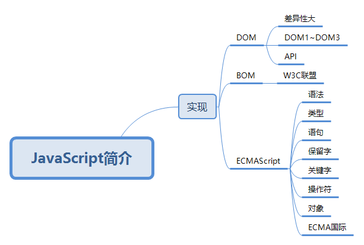
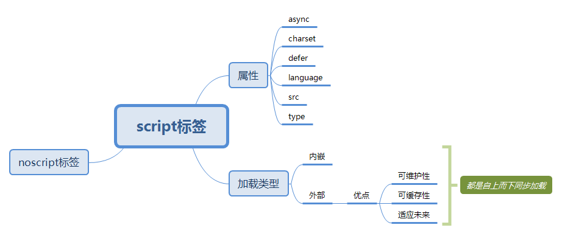
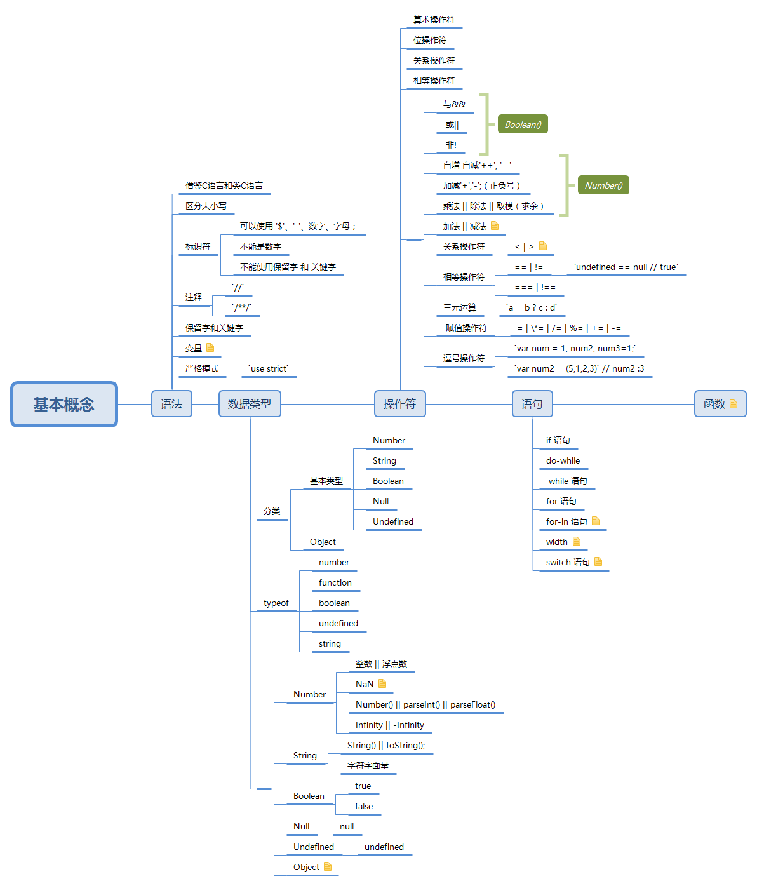
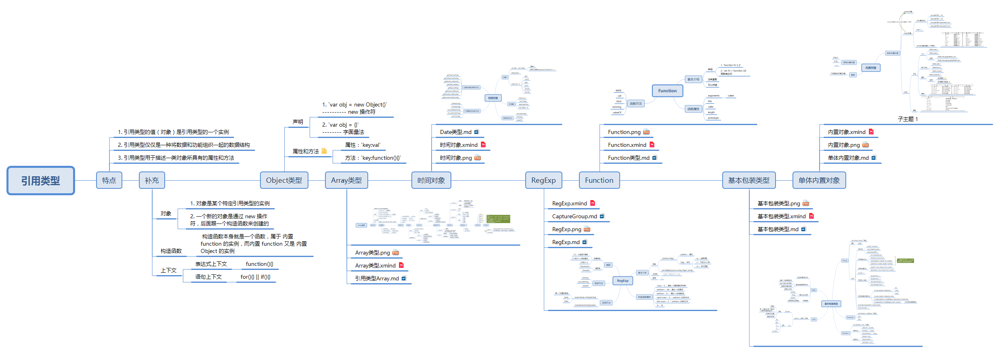

# 简介：

原本没有在文件上编上序列，想着需要回顾哪一章就看哪一章的了，但是整体复习的时候感觉无从下手，所以做一些简单的介绍；就算是 README.md 了

## 1. JavaScript 高程三

### 1.1 JavaScript 简介

这一章的内容较为简单，但是对于认识 js 十分有帮助

### 1.2 在HTML中使用JavaScript

同样没有特别复杂的地方，介绍了在 HTML 中使用 JavaScript 的方式

### 1.3 基本概念

对语法 || 语句 || 保留字和关键字 || 变量 || 数据类型 || 流控制语句 || 函数 简单的介绍了一遍

### 1.4 变量和作用域及内存问题

基本类型 || 引入类型 || 执行环境 || 垃圾收集

### 1.5 引用类型

使用对象 || 创建并操作数组 || 理解基本的JavaScript类型 || 使用基本类型和基本包装类型
这一节十分重要

### 1.6