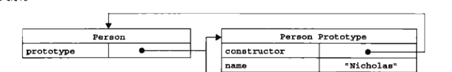
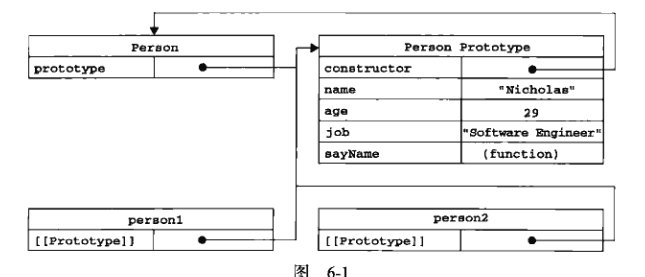
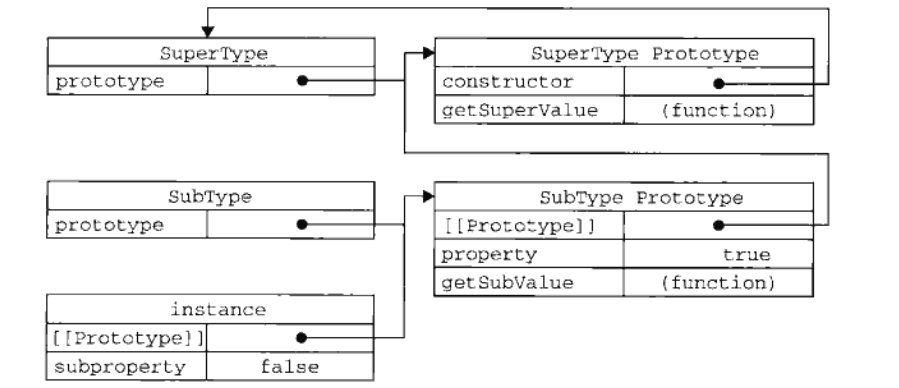

# 面向对象的程序设计（JavaScript高程三）

## 1. 理解对象

<!-- 这里的内容比较枯燥，但是对于理解对象十分有利，那就耐着性子读下去吧 -->

创建自定义对象最简单的方法就是创建一个Object实例：

```
    var person = new Object();
    person.name = '小米';
    person.age = '29';
    person.job = 'student';
    person.sayName = function () {
        alert(this.name);
    }
```

对象字面量：

```
var person = {
    name: '小米',
    age: '29',
    job: 'student',
    sayName: function () {
        alert(this.name);
    }
}
person.sayName();
```

两种方法创建的对象，的属性在创建的时候都带有一些特征值，JavaScript通过这些特征值定义他们的行为；

### 1.1 属性类型

数据属性 || 访问器属性
内部属性：是为了内部使用的属性，不能通过JavaScript直接访问，E5规定内部使用的属性使用[[]]包裹

1）定义数据属性
数据属性包含一个数据值的位置，在这个位置上可以读取和写入，共有4个描述其行为的特性；

[[Configurable]] || [[Enumerable]] || [[Writable]] || [[Value]]

-[[Configurable]] || adj. 可配置的；结构的
表示能否通过delete删除属性或者修改属性；
在对象中定义的属性中默认为true；

-[[Enumerable]] || adj. 可列举的；可点数的
表示是否能通过for-in循环返回属性；
在对象中定义的属性中默认为true；

-[[Writable]]
表示能否修改属性的值
在对象中定义的属性中默认为true；

-[[Value]]
包含这个属性的值；
读取属性值的时候，从这个位置上读取，写入属性的时候将新的值保存到该位置。
这个特性的默认值为-undefined

```
    /*[[Value]]*/
    var person = {
        name: "Jack"
    }
    /* 这里的创建了一个name的属性，属性值被设置成Jack，对属性值的任何修改，都将反映到该位置上 */
```

如果需要修改属性的默认特性，必须使用E5中的`Object.defineProperty()`，方法：

语法：
    `Object.defineProperty(属性所在对象，属性名，一个描述符对象)`
    注：描述符对象-- configurable、 enumerable、 writable、 value、可以通过对象的格式同时修改多个值（注意这里的都是小写）；
    而在调用defineProperty()这些值的默认值是false;

实例：

```
    /*[[Writable]]*/

    var person = {};
    Object.defineProperty(person, 'name', {
        writable: false,
        value: 'Jack'
    });

    alert(person.name); // Jack
    // person.name = 'P';

    delete person.name;

    alert(person.name); // Jack
```

configurable

```
        var person = {};

        Object.defineProperty(person, 'name', {
            value: 'Jack',
            configurable: false
        });

        alert(person.name) // Jack

        person.name = 'b';
        delete person.name;

        alert(person.name) // Jack

        Object.defineProperty(person, 'name', {
            configurable: true
        })

        person.name = 'b';

        alert(person.name); // Uncaught TypeError
```


1. configurable 设置为false的时候, 修改属性值时，在非严格的模式下会忽略，而在严格模式下会拋错；
2. 当 configurable 设置 false的时候，就不能再修改除writable外的特性；

2）定义访问器属性

getter 函数 || setter 函数

访问器属性不包含数据值，而是两个函数（不是必须的），当读取访问器属性的时候，会调用getter函数，由这个函数返回有效的值，而在写入的访问器属性的时候，会调用setter函数并且传入新的值，这个函数负责决定如何处理数据

访问器属性 具有下面4个特性

[[configurable]] || [[Enumerable]] || [[Get]] || [[Set]]

访问器属性不能直接定义，只能通过 `Object.defineProperty()`来定义，

[[Configurable]]
表示能否通过delete删除属性从而重新定义属性，能否修改属性的特性，
对于直接在对象上定义的属性，这个特性的默认值为true。

[[Enumerable]]
表示是否能够通过for-in循环返回属性；
对于直接在对象上定义的属性，这个特性的默认值为true。

[[Get]]
在读取的时候调用的函数，默认值为undefined

[[Set]]
在写入的时候调用的函数，默认值为undefined

实例：
get || set

```
    <script>
        var book = {
            _year: 2004,
            edition: 1
        };

        Object.defineProperty(book, 'year', {
            get: function () {
                return this._year + 1;
            },
            set: function (newValue) {
                if (newValue > 2004) {
                    this._year = newValue;
                    this.edition += newValue - 2004;
                }
            }
        });

        alert(book.year); // 2005

        book.year = 2010;
        alert(book.year); // 2011
        alert(book._year); // 2010
        alert(book.edition); // 7
    </script>
```

如果没有 get 则不能读取设置的属性，如果没有 set 则不能写入设置的属性；


>注：
1. 在ie9+（Ie8只实现了部分），和标准浏览器下才支持Object.definedProperty()方法
2. 在不支持 Object.defineProperty() 的浏览器中就不能修改configurable 和 enumerable

### 1.2 定义多个属性

Object.definePropertys()

```
    <script>
        var book = {
            _year: 2001
        };

        Object.defineProperties(book, {
            name: {
                value: 'name'
            },
            reader: {
                value: 'people'
            },
            year: {
                get: function () {
                    return this._year + 10;
                },
                set: function (value) {
                    this._year = value + 'set'; // 这里只能修改写在字面量里的属性，
                    this.name = value + '不能修改';
                    // 不能修改数据类型设定的属性
                }
            }
        });

        alert(book.name) // name
        alert(book.year) // 2011
        book.year = 100;
        alert(book.name) // name
        alert(book._year) //100set
    </script>
```


>注：
1. 在ie9+（Ie8只实现了部分），和标准浏览器下才支持Object.definedPropertys()方法

### 1.3 读取属性的特性

Object.getOwnPropertyDescriptor()

```
    <script>
        var book = {
            _year: 2001
        };

        // book

        var a = Object.getOwnPropertyDescriptor(book, '_year')
        console.log(a)
        /*
        learnOO_读取属性特性.html:16
        Object {value: 2001, writable: true, enumerable: true, configurable: true}configurable: trueenumerable: truevalue: 2001writable: true__proto__: Object
         */

         Object.defineProperties(book, {
            name: {
                value: 'book',
                writable: false,
                configurable: false,
                enumerable: false
            },
            color: {
                get: function () {
                    return 1
                },
                set: function(value){
                    this._year = value+'year'
                }
            }
         })

         alert(book.color) // 1
         book.color = 2;
         alert(book._year) // 2year

         var b = Object.getOwnPropertyDescriptor(book, 'name');
         console.log(b)
         /*
         Object {value: "book", writable: false, enumerable: false, configurable: false}
          */

         var  c = Object.getOwnPropertyDescriptor(book, 'color');
         console.log(c)
         /*
         Object {enumerable: false, configurable: false}configurable: falseenumerable: falseget: ()set: (value)__proto__: Object
          */
    </script>
```

## 2. 创建对象

虽然通过 `new Object` 和 字面量的方法都能够创建一个对象，但是使用同一个接口创建很多对象，就会产生大量重复的代码。

### 2.2 工厂模式

使用函数封装以特定结构创建的对象的细节

```
工厂模式.html
    <script>
        function createPearson (name) {
            var p = new Object();
            p.name = name;
            p.sayName = function () {
                alert(this.name)
            }
            return p;
        };

        var person1 = createPearson('小明');
        var person2 = createPearson('小包');

        person1.sayName();
        person2.sayName();

    </script>
```

这种方式可以，接受一个参数，然后返回一个带有属性和方法的对象；
工厂方式的缺点，是没有解决对象识别的问题，即怎样知道一个对象的类型，(因为这里你不知道是否是在创建对象，还是仅仅在调用函数，而构造函数模式可以通过 new 来识别)

### 2.2 构造函数模式

原生的构造函数： Function || Array || Object 等
除了原生的构造函数，还可以自定义构造函数：

```
learnOO_构造函数模式.html

    <script>

        function CreatePerson (name) {
            this.name = name;
            this.showName = function () {
                alert(this.name)
            }
        }

        var person1 = new CreatePerson('小白');
        var person2 = new CreatePerson('小黑');
        person1.showName()
        person2.showName()

    </script>
```

与工厂模式不同：
1. 没有显示的创建对象；
2. 直接将属性和方法赋值给了this对象；
3. 没有 return 语句；

按照惯例一个构造函数的函数名的首字母大写；
要创建一个Person的实例，需要使用 new 的操作符；

使用 new 会完成以下的行为：

1. 创建一个新对象；
2. 将构造函数的作用域给新的对象（因此this会指向这个新的对象）；
3. 执行构造函数中的代码（给这个新的对象添加属性）；
4. 返回新的对象；

---------
注：
1. 创建自定义的构造函数可以将它的实例标识为一种特定的类型，这一点优于工厂模式；

2. 构造函数都是函数，所以构造函数是function的实例；而作为实例就会沿着`__proto__`查找，作为构造函数就会具有prototype

3. 一般实例都是对象，所以沿着`__proto__`会查找到Object

注：所有的对象均继承自Object，所以person1 和 person2 也是Object的实例

举例：
var a = new Array;
a -> `__proto__` ->Array.prototype（走到这一步的时候，Array是作为构造函数存在的，所以先查看prototype） -> `__proto__` -> object.prototype
而
Array -- 这里查找的时候是作为实例查找的，所以是走`__proto__`_查找
Array —> `__proto__`->function.prototype


### 2.3 constructor

每一个实例下都会添加一个constructor属性，这个属性指向该实例的构造函数，但是可以被修改；

```
console.log(person1.constructor); // function CreatePerson(){};
console.log(person1.constructor == CreatePerson); // true;
```

对象的constructor属性是用于表示对象的类型的，但是由于constructor是可读可写的所以，对于检测对象类型来说不如instanceof操作符，而instanceof操作符在跨页面的检测中同样存在问题，所以不如toString操作符；

```
    alert(person1 instanceof CreatePerson); // true;
    alert(person1 instanceof Object) // true;
    alert(person1 instanceof Array) // false;
```

### 2.4 深入理解构造函数

1）将构造函数当做函数

构造函数同样也是函数，如果直接调用函数会发生什么？

```
    <script>
        function CreatePerson (name) {
            this.name = name;
            this.showName = function () {
                alert(this.name)
            }
        }
        var person1 = new CreatePerson('小白');
        person1.showName(); // 小白

        CreatePerson('小黑');
        window.showName() // 小黑

        var o = new Object();
        CreatePerson.call(o, '小黄')
        o.showName(); // 小黄

        console.log("address")
    </script>
```

这里说明了当不适用new 的时候，谁去调用this就指向谁，然后为这个this添加方法和属性

2）构造函数的问题

存在的问题：构造函数中每个方法都会在实例上重新创建一遍，也就是说同一个方法被创建了两次，造成了性能的浪费；

解释：

```
    <script>
        function CreatePerson (name) {
            this.name = name;
            this.showName = new Function (alert(this.name));
        }
        var person1 = new CreatePerson('小白');
        person1.showName(); // 小白

        var person2 = new CreatePerson('小黑');
        person2.showName() // 小黑
/*
    两次创建实例的时候，就创建了两个function的实例;
 */

        console.log("address")
    </script>
```

但是如果仅仅将这个函数一道构造函数外，又会污染全局，所以就要使用prototype；


### 2.5 原型模式：

我们创建的__每一个函数__都有一个 prototype 属性， 这是一个指针指向一个对象（原型对象），包含特定类型的所有__实例的属性和方法__ 也就是说： prototype 就是通过调用构造函数而创建的那个__对象实例__的原型对象，

--构造函数通过prototype指向原型对象，而实例通过proto指向prototype



优点： 不必再构造函数中对于对象实例的信息，而是可以将这些信息添加到原型对象中；

注：
新对象的属性和方法都是所有实例共享的；

1） 理解原型

只要创建一个函数，就会创建一个prototype属性，这个属性指向原型对象，每个原型对象都会自动获得一个constructor的属性，这个属性包含一个指向prototype属性所在函数的指针，原型对象只会默认获取constructor一个属性，至于其他方法都是从Object上获取的；
当一个实例被创建的时候，就会包含一个指针--`__proto__`__指向构造函数的原型对象__；

注：`__proto__`是存在实例与原型对象之间而不是实例与构造函数之间，

示例：

```
    <script>
        function Create (name) {
            this.name = name;
        };
        Create.prototype.sayName = function(){
            alert(this.name)
        };
        var person1 = new Create('小明');
        person1.sayName(); // 小明

        var person2 = new Create('小白');
        person2.sayName() // 小白
    </script>
```

图解：




person1 和 person2 指向原型对象，构造函数的 prototype 指向原型对象，也就看出实例和其构造函数之间没有直接的联系，当实例需要调用构造函数中的 sayName 方法的时候，实际是通过原型链查找到原型对象上的属性找到的；

2）isPrototypeOf || getPrototypeOf

isPrototypeOf 是用于检测 原型对象 和 实例的原型链指向的原型对象

```
    alert(Person.prototype.isPrototypeOf(person1)); //true
    alert(Person.prototype.isPrototypeOf(person2)); //true
```

getPrototypeOf 返回`__proto__`的值

```
    console.log(Object.getPrototypeOf(person1)) // Object
    alert(Object.getPrototypeOf(person1) == Person.prototype) // true
```

原理：当查找一个属性的时候，首先会查找实例对象的属性，如果找到了，就停止查找，并返回，如果没有找到，就会找到其`__proto__`指向的原型对象，如果在其原型对象下面的找到了，就返回，找不到就继续找到其`__proto__`,继续查找，因为每一个构造函数都是函数，也就是函数的实例化对象，而最高就是Object


3）实例属性的屏蔽

虽然可以通过对象查找构造函数的属性和方法，但是不能通过对象的实例重写原型中的值，因为如果在实例中添加一个属性，那么在查找的过程中，看到实例中存在属性，就不会沿着原型链向上查找了，也就是说实例中的属性将构造函数的属性给屏蔽了；

被屏蔽的属性，仅仅是被屏蔽了，并没有消失，所以如果删除（delete）实例中的属性，依旧可以找到其构造函数的属性；

4）hasOwnProperty()

hasOwnProperty()用于检测一个实例的属性是实例的还是其构造函数的。

```
    alert(person1.hasOwnProperty('sayName')) // false

    person1.sayName = function () {
        alert(1)
    }
    alert(person1.hasOwnProperty('sayName')) // true
```

true -- 是实例的属性
false -- 是原型对象的属性


5） 原型 和 in
in有两种使用方式，1：单独使用，2：在for-in中使用；

1、 in

in在单独使用的时候，会返回一个布尔值，当属性存在的时候（无论是实例的属性还是原型对象的属性）就会返回true，否则返回false

`attr in Object`

问题： 如何判断一个属性是其原型对象上的？

使用hasOwnProperty只能判断其不是实例的属性，而通过in可以判断这个实例能不能够访问到，也就是说不是实例本身的属性，但是实例可以访问到，那么这个属性就是属于其原型对象身上；

```
    <script>
        function Create () {
        }
        Create.prototype.name = '小白';

        /**
         * [hasPrototypeProperty description]
         * @param  {String}  attr 代表查找的属性
         * @param  {一个实例化对象}  obj  查找的目标
         * @return {Boolean}      为真就是在目标的原型
         */
        function hasPrototypeProperty (attr, obj) {
            return (attr in obj) && !obj.hasOwnProperty(attr);
        }


        var a = new Create()

        var b = hasPrototypeProperty('name', a)

        alert(b) // true

        a.name = '小黑'

        var c = hasPrototypeProperty('name', a)

        alert(c) //false
    </script>

```


2、 for-in

for-in 在循环时，返回的是所有能够通过对象访问的，可枚举的属性，其中既包括存在于实例的属性，也包括存在于原型中的属性(这是一个严重的问题)，但是所有由开发人员定义的属性都是可以枚举的；

问题：如何解决for-in的时候循环到原型对象中的属性；


```
for (attr in obj) {
    if (obj.hasOwnProperty(attr)) {
      console.log(attr)
    }
}
```

实例：

```
<script>
    function c (a) {
    }
    c.prototype.b = 'a';

    var d = new c;
    d.name = 1;

    for (attr in d) {
        if (d.hasOwnProperty(attr)) {
          console.log(attr) // name
        }
    }
</script>
```


在E5 中，Object.key() 反回一个存放能够通过对象访问的，可枚举的属性；

Object.getOwnPropertyName() 反回一个存放能够通过对象访问的;

6） 更简单的原型语法

每次给一个原型添加一个属性都要使用`obj.prototype = `, 为了减少不必要的输入，可以通过一个包含属性和方法的对象字面量来重写整个原型对象；

例：
```
        function Create () {
        }
        Create.prototype= {
            name: '小贝',
            sayName: function () {
                alert(this.name)
            }
        }
        var a = new Create;

        a.sayName() //小贝
```

问题：隐形的修改了原型对象中，constructor的指向

```
        alert(a instanceof Create) //true
        alert(a.constructor == Create) // false
        alert(a.constructor == Object) // true
```

所以需要修正constructor的指向；

```
        Create.prototype= {
            constructor: Create,
            name: '小贝',
            sayName: function () {
                alert(this.name)
            }
        }
        var a = new Create;

        alert(a.constructor == Create) // true
        alert(a.constructor == Object) // false
```

但是如果直接这样写，constructor就成为了可枚举的属性；
如果需要严谨一些：

```
    Object.defineProperty(Create.prototype, 'constructor', {
            value: Create,
            enumerable: false
        })
```

7） 原型的动态性：

由于在原型查找属性，是一次搜索，所以对原型的修改都能立即实现，即使先创建了实例，在修改原型对象，都可以，但是通过重写原型对象的方法，就不能在创建实例后，继续修改原型对象了，因为重写原型就切断了，现有原型对象和以前创建的对象实例之间的关系，当创建对象的时候，指向的原型被重写了，那么重写原型对象之前的实例是访问不到新创建的原型个的，它引用的仍然是原来的原型对象；

8）原生对象的原型

原生的对象也是基于原型的；

9）原型对象的问题

原型对象的特点是共享，所有的实例都共享原型对象，这样就会存在一些问题，对于函数和基本类型都没有问题，因为在实例上添加一个同名属性可以屏蔽原型对象中的属性；问题存在于具有引用类型值的属性；当对引用类型值的属性进行操作时就会影响该构造函数下所有的实例对象；所以单独使用原型模式并不合适；

### 2.6 原型模式 和 构造函数模式：

函数模式的缺陷在于每次创建都是完全独立，浪费性能；
原型模式的缺陷在于过于共享；

组合使用原型模式和构造函数模式就是一个很好的解决方案：
即：使用构造函数模式用于定义实例属性（需要独立的属性），而使用原型模式定义方法和共享属性（也就是不会更改的属性）

```
    <script>
        function Create (name) {
            this.name = name;
        }
        Create.prototype= {
            sayName: function () {
                alert(this.name)
            }
        }
        var a = new Create('小贝');
        a.sayName();

    </script>
```

### 2.7 动态原型模式

动态原型模式和上面所说的组合模式十分类似；
主要是将所有的属性和方法都写在构造函数中，但是通过if语句是方法只会创建一次
仅作了解：

```
    <script>
        function Create (name) {
            this.name = name;
            if (typeof this.sayName != 'function')  {
                Create.prototype.sayName = function () {
                    alert(this.name)
                }
            }
        }

        var a = new Create('小贝');
        a.sayName();

    </script>
```


注： 还有两种构造函数模式：1. 寄生式构造函数模式 2.稳妥构造函数模式，都基于工厂模式改造，但是不常用，不做叙述；

## 3. 继承
面向对象中，继承分为两种：接口继承 || 实现继承
JavaScript不存在接口，所以只能实现继承，即通过原型继承属性和方法

### 3.1 原型链

构造函数 原型 实例的关系：

每一个构造函数都有个原型对象，每一个原型对象都包含一个指向构造函数的指针，而实例都包含一个指向原型对象的内部指针；

如果将一个原型对象去等于另一个构造函数的实例，那么这个原型对象下就会多出一个指向另一个构造函数的原型对象指针，而在这个原型对象中，还存在指向其父级构造函数原型对象的指针，一层一层的向上查询，直到遇到prototype为空的对象即Object；

实例：

```
    <script>
        function SuperType () {
            this.property = true;
        }
        SuperType.prototype.getSuperValue = function(){
            return this.property;
        };

        function SubType () {
            this.subproperty = false;
        }

        SubType.prototype = new SuperType();

        SubType.prototype.getSubValue = function () {
            return this.Subproperty;
        }
        var instance = new SubType();
        alert(instance.getSuperValue()) // true
    </script>
```

实现过程：
首先会在instance（实例对象）中查找，没有找到，就通过其原型链找到其构造函数的原型对象，此时原型对象指向了一个实例对象，并且还添加了getSubValue的方法，所以这个原型对象下就包含了一个getSubValue的方法，以及一个指向SuperType的原型对象的指针，在这个原型对象中依旧没有找到getSuperValue方法，于是继续沿着原型链查找到SuperType的原型对象，最终在SuperType的原型对象下找到了getSuperValue方法，返回；

注意：
1. 这里由于getSubValue的原型对象指向了一个getSuperValue实例对象，所以constructor就是实例对象指针指向的getSuperValue的原型对象下的constructor，需要修正

2. 如果在SuperType的原型对象下没有找到getSuperValue方法，那么就会沿着SuperType的原型对象下的指向其构造函数Object的指针，找到Object；

```
    <script>
        function a () {
            this.name = 'xiao';
        }
        a.prototype.say = function(){
            alert(this.name)
        };
        var b = new a;

        alert(Function.prototype.isPrototypeOf(a)) // ture
        alert(Object.prototype.isPrototypeOf(a)) // ture
        alert(Object.prototype.isPrototypeOf(Function)) // ture
        alert(Function.prototype.isPrototypeOf(Object)) // ture
    </script>
```

从这里可以看到一个关系，所有的构造函数都是函数，但是所有的构造函数都是Object的
但是：
```
    alert(Object.prototype === Object.getPrototypeOf(Function)) // false
    alert(Object.prototype === Object.getPrototypeOf(Function.prototype)) // true
```

解释：
1. javascript中，“函数”（方法）也是对象。
2. 一切对象都有一个根源。它是Object.prototype。
根源之上再没有其他根源。Object.getPrototypeOf(Object.prototype)是null。js中除字面量以外的一切引用对象都来自这个“根源”对象。
3. 表达式Object.getPrototypeOf(Function) === Function.prototype的结果是真。这是Function特有的。实际上Function的prototype是一个内置函数，一切函数都派生自这个内置函数，这个内置函数是一个函数工厂。这个内置函数对象的prototype指向“根源”对象。
4. 表达式Object.prototype === Object.getPrototypeOf(Function.prototype)的结果是真。说明了Object跟Function二者之间的联系，是通过“根源”对象联系起来的。
function Object 其他函数 都是由系统的内置函数构成，而内置函数由根源对象构成

所以有时Function可能是指内置函数，Object可以说的是根源对象，才会有

```
    alert(Object.prototype.isPrototypeOf(Function)) // ture
    alert(Function.prototype.isPrototypeOf(Object)) // ture
```

unction和Object，既是函数，因为都可以Function()或者Object()这样的方式执行，又是对象，因为可以Function.a = 'a',Object.a = 'a'这样赋值。

说它们是函数，是因为他们都是通过上面第4条中说的”内置函数工厂“，派生出来的，因而具备函数的特性。

说他们是对象。是因为他们都是通过上面第1条中的”根源“对象，派生出来的，因此具备对象的特征。

继续说一下，Function.prototype指向”内置函数“。而Object.prototype指向”根源对象“。
因而new Function会产生一个匿名函数，而new Object产生一个plain object。

Object的原型链指针指向null；所以Object就是原型链的终点
`alert(Object.getPrototypeOf(Object.prototype))// null`




#### 3.1.1 确定原型和实例之间的关系

instanceof || isPrototypeOf()

instanceof
只要是检测实例与原型链中出现过的构造函数，就返回真
isPrototypeOf()
检测一个实例是不是由一个原型对象派生出来的，如果是就返回true

#### 3.1.2 谨慎定义方法

当子类型需要改变，或添加某个方法或者属性，一定要放在替换原型的语句之后;
否则会由于重写原型对象导致，添加无效；如果将一个原型对象替换成一个字面量对象，那么就会切断这个实例与其构造函数的原型对象的所有联系；

#### 3.1.3 原型链的问题

如果在原型链指向的原型对象中存在引用类型的变量，在继承时就会出现问题，
1. 对继承的子对象的改变会影响继承的父级对象；
2. 在创建子类型的实例的时候，不能像超类型（继承的父级）传递参数；

这是就需要借用构造函数了，

#### 3.1.4 组合继承

构造函数创建的实例，实例的属性会创建一个副本，这样改变副本就不会对父类产生影响，但是只使用构造函数创建实例，就会导致代码没有复用性。将构造函数和原型继承组合起来，就可以解决这两个问题；

实例：
```
    <script>
        function a () {
            this.num = [1,2,3];
        }
        a.prototype.say = function(){
            alert(this.num)
        };
        function b () {
            a.call(this);
        }
        b.prototype = new a();
        var c = new a;
        var d = new b;

        d.num.push(4);
        console.log(c.num) // 123
        console.log(d.num) // 1234
    </script>
```

借用构造函数传递参数
```
    <script>
        function a (name) {
            this.name = name;
            this.num = [1,2,3];
        }
        a.prototype.say = function(){
            alert(this.num)
        };
        function b (name) {
            a.call(this, name);
        }
        b.prototype = new a();
        var c = new b('c');
        var d = new a('d');

        console.log(c.name) // c
        console.log(d.name) // d
    </script>
```


这种组合式继承同样具有缺陷：
就是调用了两侧超类的构造函数--这时就要使用寄生组合式继承


### 3.2 原型式继承

```
    function object (o) {
        function F(){}
        F.prototype = o;
        return new F();
    }
```

创建一个新的构造函数，让构造函数指向实例，然后返回一个新的实例；这样就将原有对象的实例拷贝了一份

实例：
```
    <script>
        function object (o) {
            function F(){}
            F.prototype = o;
            return new F();
        }

        var a = [1,2,3,4]

        var b = object(a);
        b.push(8);

        alert(b) // 1.2.3.4.8
        alert(a) // 1.2.3.4
    </script>
```

但是包含引用类型值的属性始终都会共享相应的值，

在E5 中 Object.create() 规范了原型式继承；
可以传入两个参数，一个是要拷贝的对象，一个是要想这个对象中添加的属性；

### 3.3 寄生式继承

```
    <script>
        function object (o) {
            function F(){}
            F.prototype = o;
            return new F();
        }
        function createAnother (o) {
            var clone = object(o);
            clone.sayHi = function () {
                alert('hi')
            }
            return clone;
        }

        var a = [1,3,4]
        var b = createAnother(a);
        b.push(9);
        alert(b)
        alert(a)
    </script>
```

通过这种方式为对象添加方法，存在一个问题：代码不能复用

### 3.4 寄生组合式继承

```
    function object (superType) {
        function F () {};
        F.prototype = superType;
        return new F();
    }
    function inheritPrototype (subType, superType) {
        var prototype = object(superType.prototype);
        prototype.constructor = subType;
        subType.prototype = prototype;
    }
```

与书上有些出入，但是实验书本上并不能实现，其说的功能
应该是出现了误印；
实例：
```
    <script>
        function object (superType) {
            function F () {};
            F.prototype = superType;
            return new F();
        }
        function inheritPrototype (subType, superType) {
            var prototype = object(superType.prototype);
            prototype.constructor = subType;
            subType.prototype = prototype;
        }

        function a () {}
        a.prototype = {
          name: 9
        }

        function b () {}

        inheritPrototype(b, a)
        b.prototype.name = 12;
        var d = new a()
        var c = new b()

        alert(c.name) //12
        alert(d.name)//9

    </script>
```

补：
对象构造函数（Object）为给定值创建一个对象包装器。如果给定值是  null or undefined，将会创建并返回一个空对象，否则，将返回一个与给定值对应类型的对象。
当以非构造函数形式被调用时，Object 等同于 new Object()。

总结：原型式继承不需要预先定义构造函数的情况下，实现浅复制；
寄生式继承，基于对象创建一个对象，然后为这个对象添加方法属性，然后返回，就是将添加的行为封装起来，但是不符合复用的原则，
寄生组合式继承，集合寄生继承的优点 和 组合的优点，形成的一种继承的方法；


补充：
```
    <script>
        var a = [1,2,3]
        var b = a; // 猜测是将a挂在了b的原型连上了，当b找不到时，就找a，如果b找到了就不在找了
        b.push(4)
        console.log(a) // [1,2,3,4]
        console.log(b) // [1,2,3,4]

        var c = a;
        c = [4,5,6]; // 这里表示了新创建了一个实例，就和a没有关系了;
        console.log(c) // [4,5,6]

    </script>
```
