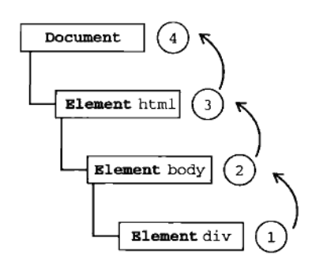
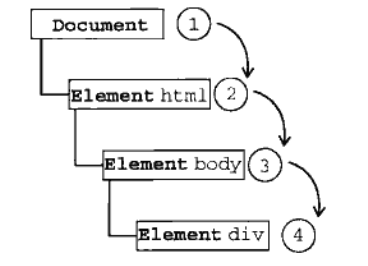
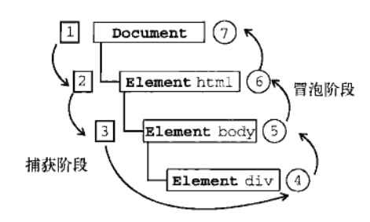
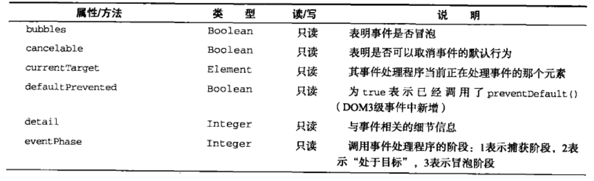
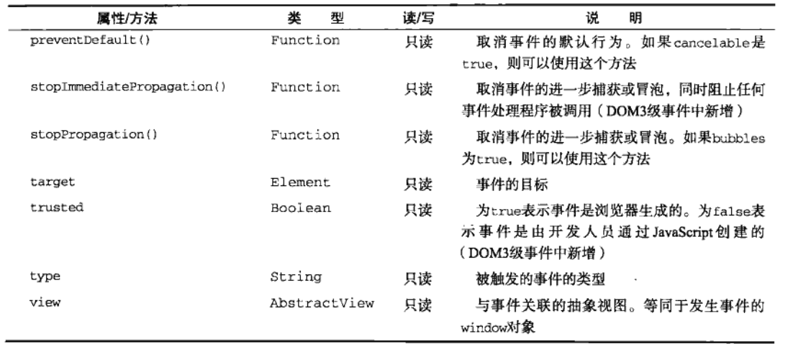
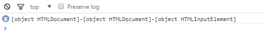
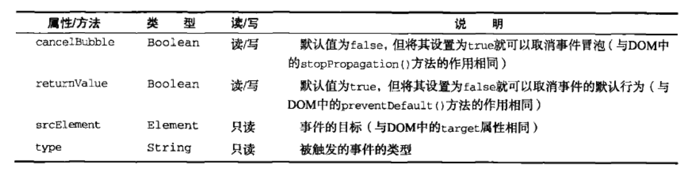

#事件
---------JavaScript高程三----------
JavaScript和HTML之间的交互是通过事件来实现的，可以通过侦听器(或处理程序)，来预订事件。

##1-事件流：

事件流描述的是从页面中接收事件的顺序

事件冒泡 || 和事件捕获

事件流分为两种，IE实现事件流的方式是事件冒泡，而网景实现事件流的方式是事件捕获，目前，低版本的IE(IE8及以下)只支持事件冒泡，而标准浏览器支持事件冒泡和事件捕获；

###1.1-事件冒泡：

在结构：
```
<!DOCTYPE html>
<html lang="en">
<head>
    <meta charset="UTF-8">
    <title>Document</title>
</head>
<body>
    <div></div>
</body>
</html>
```
中，如果点击div，那么事件冒泡的处理方式是



也就是说，当事件发生在div上后，事件会沿着DOM树向上传播一直到document(根节点)，在标准浏览器中会一直传播到window，相当于每一级节点按照冒泡的先后顺序都触发了该事件；

###1.2-事件捕获：

事件捕获的实现是以DOM树的根节点到目标节点的顺序传递并触发事件；
以1.1的结构为例，事件捕获的触发顺序是：



>注：
1. 虽然规范中要求从document开始捕获，但是目前浏览器都是从window出开始捕获；
2. 由于低版本浏览器的不支持，所以除非必要就不要使用事件捕获；

###1.3-DOM事件流：

在DOM2级事件中，规定事件包括3个阶段，事件捕获，处于目标阶段，事件冒泡。



如上图，当点击div时，发生事件捕获，然后在div的上一级节点(body)处结束捕获，并执行到处于目标阶段，然后发生事件冒泡，在事件处理中，将处于目标阶段，视为事件冒泡阶段的一部分。

在DOM2中规定，在事件捕获的过程中不会触发目标事件，但是在标准浏览器中(IE8及以下不具有捕获)，事件在捕获的过程中就会发生；

##2-事件处理程序

事件是指在用户进行交互时执行的行为，比如：click、load等等，而相应这些行为的函数就叫做事件处理程序(或事件侦听器)，比如：onclick、onload等等。

###2.1-HTML的事件处理程序

（由于，这种方式具有诸多缺点，并不实用，不做过多介绍）

将事件写在HTML中可以执行，全局域中的函数；
在HTML中的事件，this指向该元素；


###2.2-DOM0级事件处理程序

1）事件的赋值
将一个函数赋值给一个**元素的事件属性**，整个过程叫做事件处理程序

`document.onclick = function(){}`

事件处理程序，不会发生预处理，只有在执行这段代码中才会指定事件处理程序；
由于函数赋值给元素属性，所以该函数的是在该元素的作用域下运行；

这种方式添加的事件处理程序，会在事件冒泡阶段(处于目标阶段，被归于事件冒泡阶段)被处理。

2）事件的删除

如果想删除某个事件处理程序。只需要：

`document.onclick = null;`

基于事件处理程序是一种对元素事件属性赋值的行为这一理论，删除事件处理程序就很好理解了，删除事件处理程序，就是将该属性重置于null;

###2.3 DOM2级事件处理程序

使用DOM2级事件处理程序的主要好处是，可以同时添加多个事件处理程序；
IE9及以上支持DOM2级的事件处理程序；

####2.3.1 处理事件的两个方法
DOM2级事件定义了两个方法用于处理事件：
1-addEventListener() 用于绑定事件；
2-removeEventListener()用于解除绑定；

>注：
所有的DOM节点都具有这两个方法；

2）参数：
    `addEventListener(要处理的事件名, 要执行的函数, 布尔值)`
    `removeEventListener(要处理的事件名, 要执行的函数, 布尔值)`

布尔值：true--事件捕获时执行； false--事件冒泡执行(默认)；
>注：事件捕获存在兼容性的问题，所以如果不是特别需要就使用事件冒泡

1 addEventListener()
实例：
添加一个：
```
    <script>
        document.addEventListener('click', text, false);

        function text () {
            alert('通过事件绑定，在冒泡阶段执行');
        }
    </script>
```

添加多个：
```
    <script>
        document.addEventListener('click', text, false);
        document.addEventListener('click', text1, false);

        function text () {
            alert('这里是第一个执行程序');
        }
        function text1 () {
            alert('这里是第二个执行程序')
        }
    </script>
```

>注：添加多个的时候会以其添加时的顺序执行；

2 removeEventListener();

使用addEventListener()添加的事件，只能通过removeEventListener() 解除，移出时使用的参数要和要移出的事件绑定中的参数保持一致；

实例：
```
    <script>
        document.addEventListener('click', text, false);
        document.addEventListener('click', text1, false);
        document.removeEventListener('click', text, false);

        function text () {
            alert('这里是第一个执行程序');
        }
        function text1 () {
            alert('这里是第二个执行程序')
        }
    </script>
```

>注：如果参数匿名，就无法通过removeEventListener()移除

实例：
```
    <script>
        document.addEventListener('click', function () {
            alert('这里是第一个执行程序');
        }, false);
        document.addEventListener('click', text1, false);
        // 移出失败
        document.removeEventListener('click', function () {
            alert('这里是第一个执行程序');
        }, false);

        function text1 () {
            alert('这里是第二个执行程序')
        }
    </script>
```

##2.4 - IE事件处理程序

attachEvent() || detachEvent()
只有IE8及以下识别

语法：
    `attachEvent(事件处理程序的名称，事件处理的程序)`
    `detachEvent(事件处理程序的名称，事件处理的程序)`

###2.4.1 - 问题1：this指向问题：

使用attachEvent()时，执行函数的this指向window：

例：
```
    document.attachEvent('onclick', text1);
    function text1 () {
        alert(this) // object Window
    }
```

解决：
```
    <script>
        document.attachEvent('onclick', function () {
            text1.call(document);
        });
        function text1 () {
            alert(this) // object HTMLDocument
        }
    </script>
```

> 注：这里使用了匿名函数，虽然修正了this指向的问题但是无法解除；

###2.4.2 - 问题2：事件执行程序名称

在addEventListener()中，事件的执行程序名称不带'on'，而通过attachEvent()中，带'on';

###2.4.3 - 问题3：函数的执行顺序

与addEventListener()相反，先添加的后执行；

```
    <script>
        document.attachEvent('onclick', function () {
            text1.call(document);
        });
        document.attachEvent('onclick', function () {
            text2.call(document);
        });
        function text1 () {
            alert('这里是先添加的函数')
        }
        function text2 () {
            alert('这里是后添加的函数')
        }
    </script>
```

###2.4.4 - 移出绑定的函数

通过attachEvent()添加的，只能通过detachEvent()移出；与removeEvnetListener()使用基本相同；

##2.5 - 跨浏览器的事件处理程序

EventUtil的封装

```
var EventUtil = {
    addHandler : function (element, type, handler) {
        if (element.addEventListener) {
            element.addEventListener(type, handler, false);
        } else if (element.attachEvent) {
            element.attachEvent('on' + type, handler);
        } else {
            element['on' + type] = handler;
        }
    },
    removeHandler : function (element, type, handler) {
        if (element.removeEventListener) {
            element.removeEventListener(type, handler, false);
        } else if (element.detachEvent) {
            element.detachEvent('on' + type, handler);
        } else {
            element['on' + type] = null;
        }
    }
}
```

>注：
1. 这里存在attachEvent的this指向问题；
2. 如果使用了DOM0级，就无法绑定多个；

如果需要修正this指向，就使用上面提到的方法：
```
function(){
    handler.call(element);
}
```
不过又存在无法解除的问题；

##3. 事件对象

当触发DOM上的某个事件的时候，会产生一个event对象，这个对象中储存着和这个事件有关的信息，包括触发事件的元素，事件的类型，以及其它与该事件相关的信息；所有的浏览器都支持event对象，但是支持方式不同；

>注:event对象只会存在事件发生的过程中，一旦事件结束，event对象的内容立即销毁

###3-1 DOM中的事件对象

在兼容DOM的浏览器下，event对象会传入事件处理程序中，表现在通过事件的注册函数的第一个参数传入事件函数中。

event对象有着一些共同的方法和属性：




>注：
evnet.cancelBubble & ev.stopPropagation();都能阻止事件冒泡，并且ev.stopPropagation()还可以阻止捕获；stopPropagation()在低版本IE中不支持，evnet.cancelBubble不是标准但是所有浏览器都兼容；

####3-1-1 currentTarget || this || target 的区别；

在事件的绑定程序中，currentTarget 和 this 一样，target是指目标点：

```
    <script>
        var btn = document.querySelector('input');
        document.addEventListener('click', text, false)
        function text (ev) {
            console.log(this+'-' + ev.currentTarget + '-' + ev.target)
            //[object HTMLDocument]-[object HTMLDocument]-[object HTMLInputElement]
        }
    </script>
```

过程：
    当点击到btn的时候，target就是btn，但是触发的事件是注册在document上的，所以currentTarget和this就是document
实例：

<a href="html/target-currentTarget-this.html" target="\_blank">实例</a>


实例：一个target和事件冒泡的案例

```
<body>
    <ul>
        <li>
            <div></div>
        </li>
        <li>
            <div></div>
        </li>
        <li>
            <div></div>
        </li>
        <li>
            <div></div>
        </li>
        <li>
            <div></div>
        </li>
    </ul>
    <script>
        var ul = document.querySelector('ul');
        ul.onclick = function (ev) {
            var ev = ev || window.event;
            var target = ev.target;
            if (target == ev.currentTarget) {
                target.style.background = '#fb3';
            }
            switch (target.tagName) {
                case 'LI':
                    target.style.background = 'red';
                    break;
                case 'DIV':
                    target.style.background = '#58a';
                    break;
                default:
                    // statements_def
                    break;
            }
        }
    </script>
</body>
```

这里的技巧是值得仔细研究的：
<a href="html/事件冒泡的应用.html" target="\_blank">实例应用</a>

####3.1.2 在一个元素上定义多个事件：

利用 ev.type 和 switch;

```
    <script>
        var div = document.querySelector('div');
        function handle (event) {
            switch (event.type) {
                case 'click':
                    alert(event.type)
                    break;
                case 'mouseover':
                    alert(event.type)
                    break;
                default:
                    // statements_def
                    break;
            }
        }
        div.onclick = handle;
        div.onmouseover = handle;
    </script>
```

<a href="html/多事件绑定.html" target="\_blank">实例</a>
感觉很厉害，但不知道在哪里使用，至少是一种思路并且易于管理；

#### 3.1.3 阻止默认事件行为

使用preventDefault()

```
    <script>
        var div = document.querySelector('div');
        div.oncontextmenu = function (ev) {
            ev.preventDefault()
            alert(this);
        }
    </script>
```

>注：只有cancelable为 true的时候才能使用preventDefault()

#### 3.1.4 eventPhase -- 属性，表示当前事件触发时处于哪个阶段；

值：
    1 - 事件捕获
    2 - 事件处理阶段
    3 - 事件冒泡

### 3.2 IE的事件对象

访问IE下的事件对象有几种不同的方式，具体取决于事件处理程序的方法，如果使用DOM0的方式，event对象就存放在window属性中，通过window.event 来访问，如果通过attachEvent()的方式，则就会有event对象，作为传参传入事件处理函数中，可以通过形参使用，并且可以通过window.event使用；

IE事件对象的都具有以下属性和方法：



1）srcElement 相当于DOM中event的target属性；
通过attachEvent()添加的事件存在this指向的问题，通过IE中的event对象的srcElement属性就会更加安全；
例 ：
```
    var oBtn = document.querySelector('input');
    oBtn.onclick = function (ev) {
        var ev = ev || event;
        alert(ev.srcElement + '-' + this)
        // 这里都指向oBtn
    }
    oBtn.attachEvent('onclick', function (ev) {
        var ev = ev || window.event;
        alert(ev.srcElement + '-' + this)
        // 这里srcElement指向oBtn而this指向window
    })
```

2）returnValue -- 相当于DOM中的preventDefault()
用于取消默认事件

3）cancelBubble属性 -- 类似于DOM中的stopPropagation()
容易取消冒泡

### 3.3 跨浏览器的事件对象

虽然IE和DOM中的事件对象存在差异，但是IE的事件对象下的方法和属性在DOM都以不同的实现方式存在。

```
/*
element -- 目标元素
type -- 事件执行程序名称
handler -- 执行函数
 */

var EventUtil = {
    addHandler : function (element, type, handler) {
        if (element.addEventListener) {
            element.addEventListener(type, handler, false);
        } else if (element.attachEvent) {
            element.attachEvent('on' + type, handler);
        } else {
            element['on' + type] = handler;
        }
    },

    // 这里我会使用ev = ev || window.event
    getEvent : function (event) {
        return event ? event : window.event;
    }
    getTarget : function (event) {
        return event.target || event.srcElement;
    }
    /*这里我会使用
        if (event.preventDefault) {
            event.preventDefault();
        } else {
            event.returnValue = false;
        }
    */
    preventDefault: function (event) {
        if (event.preventDefault) {
            event.preventDefault();
        } else {
            event.returnValue = false;
        }
    }
    removeHandler : function (element, type, handler) {
        if (element.removeEventListener) {
            element.removeEventListener(type, handler, false);
        } else if (element.detachEvent) {
            element.detachEvent('on' + type, handler);
        } else {
            element['on' + type] = null;
        }
    }
    // 目前cancelBubble在标准浏览器下也支持了，
    // 所以要取消冒泡直接使用event.cancelBubble = true就可以了
    stopPropagation: function (event) {
        if (event.stopPropagation) {
            event.stopPropagation();
        } else {
            event.cancelBubble = true;
        }
    }
}
```
