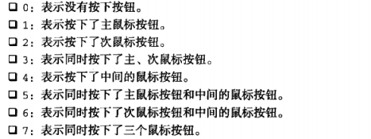

#事件2
---------JavaScript高程三----------
JavaScript和HTML之间的交互是通过事件来实现的，可以通过侦听器(或处理程序)，来预订事件。

##4. 事件类型

不同的事件类型具有不同的信息，在DOM3级事件中规定了以下几种事件

1. UI事件--（user interface）当用户与页面上的元素发生交互时触发的时间；
2. 鼠标及鼠标滚轮事件
3. 键盘事件
4. 焦点事件

###4-1 UI事件

load || unload || abort || error || select || resize || scroll

1）load：
    会在4处触发：
    1. 当页面加载完成后会在 window 上面触发。
    2. 当所有框架加载完毕，会在框架集上面触发。
    3. 当图像加载完成后，会在img元素上触发。
    4. 当嵌入的内容加载完毕时在object上面触发

详情：
1. 页面的加载是指：图像、JavaScript文件、css文件以及其他的外部的资源
2. 页面加载不仅可以使用window.onload 也可以在body标签中指定<body onload = "alert('1')">,
3. load中的event对象不包含有用的信息
4. __新图像元素不一定要从添加到文档以后才开始下载，只要设置了src属性就会开始下载__
5. 一般使用image对象在客户端实现预加载；

```
   var i = new Image()
   i.src = '1.jpg';
   i.onload = function (){............}

```

6. script也会触发onload事件，但是和img不同，script只会在元素添加在文档以后才会下载；


-----------

2）unload：
    会在3处触发：
    1. 当页面卸载完成后会在 window 上面触发。
    2. 当所有框架卸载完毕，会在框架集上面触发。
    3. 当嵌入的内容卸载完毕时在object上面触发

详情：
1. unload 发生在页面切换的时候，主要利用 unload 清除引用，以免内存泄漏。unload 产生事件对象中只包含 target 和 srcElement；


-----------

3）abort：
    当用户停止下载过程，而嵌入的内容还没有加载完成时，在object上触发；

4）error：
    会在4处触发：
    1. 当JavaScript错误时会在 window 上面触发。
    2. 当有一个框架无法加载，会在框架集上面触发。
    3. 当无法加载图片时，会在img元素上触发。
    4. 当无法加载嵌入的内容时在object上面触发

5）select：
    当用户选择文本框（input、textarea）的字符时候触发

6）resize：
    当窗口或者框架的大小发生变化的时候触发。

详情：
1. 不同浏览器的触发方式不同，一般会在浏览器窗口变化1px的时候触发。ff只会在用户停止调整窗口大小的时候才会触发 resize 。
2. 当浏览器窗口最小化或者最大化的时候也会触发；

7）scroll：
    当用户滚动带有滚动条的元素时在该元素上触发。

详情：
1. 要注意浏览器差异

检测：

是否支持DOM2的事件
`var isSupported = document.implementation.hasFeature("HTMLEvent", "2.0")`

是否支持DOM3的事件
`var isSupported = document.implementation.hasFeature("UIEvent", "3.0")`

###4-2 焦点事件

焦点事件是在页面获得或失去焦点的时候触发；

blur || focus || focusin || focusout

blur || focus -- 不支持冒泡，但是能在捕获阶段监听到
focusin || focusout -- 支持冒泡

同时存在时的执行顺序：focusout - blur - focusin  -focus；

###4-3 鼠标与滚轮事件

#### 4-3-1 在DOM3中定义了9个鼠标相关事件：

click || dblclick || mousedown || mouseup || mouseenter || mouseleave || mousemove || mouseout || mouseover

__注：mouseover || mouseout 和 mouseenter || mouseleave 的区别
1.  mouseenter 和 mouseleave 是在从元素外首次移入元素时触发；而 mouseover || mouseout 是在一个元素移入另一个元素的时候触发，即使是从目标元素移入到其后代元素，或者由后代元素移入到目标元素的时候都会触发；__

1）客户区坐标位置
相对于窗口
clientX || clientY

2）页面的坐标位置
相对于document的坐标
pageX || pageY (IE8及之前都不支持)

兼容：

`ev.pageY = ev.pageY ? ev.pageY : ev.clientY+(document.body.scrollTop || document.documentElement.scrollTop)`

3）屏幕坐标的位置
相对于电脑屏幕的距离
screenX || screenY

4）在鼠标事件中还会检测到某些键的状态

altKey || metaKey || shiftKey || ctrlKey

注：
1. IE8及之前不支持metaKey；
2. 使用metaKey会触发系统的默认事件，不知道如何阻止；

5）相关元素

在mouseover 和 mouseout 事件中有个独有的属性--relatedTarget 用于记录相关元素的信息，当鼠标移入的时候，从哪里移入目标元素的，属性就是指向谁；当鼠标移出的时候，移出到哪里就指向哪里；

在IE8及之前没有relatedTarget，但是有相似的属性 -- formElement 和 toElement

所以继续补充EventUtil.js

```
    getRelatedTarget: function (event) {
        if (event.relatedTarget) {
            return event.relatedTarget;
        } else if (event.toElement) {
            return event.toElement;
        } else if (event.fromElement) {
            return event.fromElement;
        } else {
            return null;
        }
    }
```

__relatedTarget和target都是很有意思和扩展性的属性__

6）鼠标按钮

在 mousedown 和 mouseup 的event对象下存在一个 button 属性，在DOM中该属性存放着3个值：
0 -- 代表着主鼠标按钮
1 -- 代表着中间的滚轮按钮
3 -- 代表着次鼠标按钮；

在IE8及之前也具有button属性不过这里记录的比较复杂，但是一般不会使用：



兼容：

```
    getButton: function (event) {
        if (document.implementation.hasFeature('MouseEvents', '2.0')) {
            return event.button;
        } else {
            switch (event.button) {
                case 0:
                case 1:
                case 3:
                case 5:
                case 7:
                    return 0;
                case 2:
                case 6:
                    return 2;
                case 4:
                    return 1;
            }
        }
    }
```

<a href="html/EventUtil的简单使用.html">EventUtil的简单使用</a>

7）更多事件信息：
DOM2中规定在event对象中存在一个 detail 的属性，用于给出有关事件的更多信息，对于鼠标来说，detail 会记录鼠标的在给定位置上发生了多少次单击，在同一个像素上完成一次click为一次点击，而在down 和up 之间发生了变化就会使这个数值变为0；

IE下也有为鼠标事件提供了跟多的信息但是由于支持性差，一般不会使用

#### 4-3-2 鼠标滚轮事件

1）mousewheel 事件

无论是向上滚还是向下滚都会触发mousewheel事件，该事件会冒泡。该事件下的event对象除了保存了事件所有的标准信息还保存了一个 wheelDelta 属性，当用户向前滚动鼠标的时候 wheelDelta 为120 ，当向后滚动鼠标的时候 wheelDelta 为-120；

在FireFox里鼠标的滚轮事件比较特殊 -- DOMMouseScroll，

注：
1. DOMMouseScroll -- 只能通过addEventListener进行绑定
2. DOMMouseScroll 的event对象下并没有wheelDelta属性，它的滚轮信息存放在event 的detail属性，当用户向前滚动的时候 detail 的值为 -3 ，当向后滚动的时候这个属性的值为 3；

>注：已经将FireFox的兼容处理集成到了 EventUtil

## 4-4 触摸设备

ios 和 Android 设备支持部分鼠标事件，由于没有鼠标所以有以下几点需要注意

>
1. 不支持dblclick事件，双击会导致浏览器窗口放大，而且没有办法改变该行为。
2. 轻击可单击的元素，会触发mouseover-mousedown-mouseup和click事件，但是如果在mousemove的时候发生内容变化就不会产生后续事件，可单击事件是指：那些单击可产生默认操作的元素，或是已经被指定onclick事件处理程序的元素
3. mousemove事件也会触发mouseover和mouseout事件。
4. 当两个手指放在屏幕上且页面随着手指移动而滚动的时候会触发mousewheel和scroll事件

## 4-5 无障碍性问题

未做了解

-----------

## 4-6 键盘与文本事件

### 4-6-1 简介

1）3个键盘事件

keydown || keypress || keyup

keypress 当用户按下键盘上的字符键和esc键的时候触发，

所有元素都有键盘事件，在文本输入的元素中，keydown 和 keypress是在文本框发生变化之前触发。当按住不放的时候keydown 和 keypress会重复触发。

2）1个文本事件

textInput（DOM3）

在文本插入文本框之前会触发 textInput

3） 修改键

和鼠标事件一样，都支持相同的修改键 altKey || shiftKey || ctrlKey || metaKey(IE不支持metaKey)

### 4-7  键码

在发生keydown 和 keyup 的时候，event下的keyCode中会存放该键对应的ASCII值；这里存在兼容性的问题
例如：在Firefox中 ';'的keyCode和IE/Safari是不一样的

### 4-8 HTML5事件

contextmenu || beforeunload || hashchange

由于DOM规范中并没有列出所有事件，而各个浏览器都有自己的事件，而HTML5就列出了浏览器应该实现的事件。

比较通用的有：

1）contextmenu 事件

contextmenu 事件是调出上下文事件，和单击鼠标右键还是不同的（虽说行为上相同）

contextmenu 事件是冒泡事件 -- 可以取消

2）beforeunload 事件

会在页面卸载前触发 beforeunload，然后弹出一个询问是否关闭的窗口

3）hashchange 事件

当hash值发生变的时候触发hashchange 事件（IE8及之前都不支持）

## 5 事件委托

利用事件的冒泡并配合对象的target属性进行操作，具有很多优点：

## 6 移出事件处理程序
当通过innerHTML的方式清除一个节点的子节点时，就会产生空事件处理程序，影响性能；
所以在使用这种方式清除页面的节点时候，要记得先清除该节点的事件处理程序：
