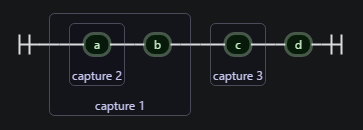
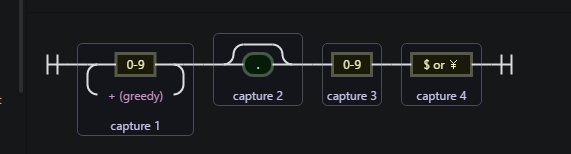
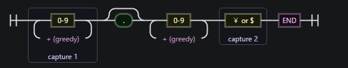
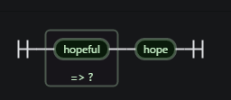

# Learn JavaScript

## 正则-捕获组 capture group

[正则中的重要概念--捕获组](http://www.cnblogs.com/yakun/p/3795589.html)
[捕获组](http://www.cnblogs.com/pmars/archive/2011/12/30/2307507.html)

### 1 基本概念

在js中的正则表达式功能，略有缺陷，如：捕获组的功能就不完备，这里仅仅介绍js中的捕获组

### 1.1 什么是捕获组

捕获组就是把正则表达式中子表达式匹配的内容，保存到内存中以数字编号或显式命名（js中仅支持数字编号）的组里，方便后面引用。当然，这种引用既可以是在正则表达式内部，也可以是在正则表达式外部。
捕获组有两种形式，一种是普通捕获组，另一种是命名捕获组，通常所说的捕获组指的是普通捕获组。语法如下：

普通捕获组：(Expression)

### 1.2 捕获组编号规则

编号规则指的是以数字为捕获组进行编号的规则，在普通捕获组或命名捕获组单独出现的正则表达式中，编号规则比较清晰，在普通捕获组与命名捕获组混合出现的正则表达式中，捕获组的编号规则稍显复杂。

在展开讨论之前，需要说明的是，编号为0的捕获组，指的是正则表达式整体，这一规则在支持捕获组的语言中，基本上都是适用的。下面对其它编号规则逐一展开讨论。

在 js 中 编号使用的是 $number 的形式 如：$0

## 2 js 的捕获组

重复单字符我们可以使用限定符，如果重复字符串，用小括号，小括号里包裹指定字表达式（子串），这就是分组。之后就可以限定这个子表示的重复次数了。
每个分组（小括号）会自动拥有一个组号,从左到右，以分组的左括号为标志，第一个出现的分组组号为1，后续递增。

用在 正则的构造函数上，以及replace中

- 实例：

        ```js
            var re = /((a)b)(c)d/g;
            var str = 'abcd';
            if (re.test(str)) {
                console.log(RegExp.$1); // ab
                console.log(RegExp.$2); // a
                console.log(RegExp.$3); // c
            }
        ```



## 3 js 中的非捕获组

### 3.1.1 (?:) -- 分组但不捕获

使用了分组，但是不编号不储存

```js
var str = '6000￥';
var re = /(\d+)+([$￥])/;
console.log(str.match(re));
var str1 = '11.1$';
var re1 = /(\d+)(\.?)(\d)([$￥])/
console.log(str1.match(re1)); // [ '11.1$', '11', '.', '1', '$', index: 0, input: '11.1$' ]

var re2 = /(\d+)(?:\.?)(?:\d+)([￥$])$/
console.log(str1.match(re2)); // [ '11.1$', '11', '$', index: 0, input: '11.1$' ]
```

`var re1 = /(\d+)(\.?)(\d)([$￥])/`

`var re2 = /(\d+)(?:\.?)(?:\d+)([￥$])$/`


### 3.1.2 (?=)和(?<=) 前后查找

有的资料把它们叫做肯定式向前查找和肯定式向后查找；

有的资料也叫做肯定顺序环视和肯定逆序环视。

分组必等不捕获, 如果存在才会继续匹配后面的

1. (?=)

        ```js
            var re = /[0-9a-z]{2}(?=aa)/g;
            var str = "12332aa438aaf";
            console.log(str.match(re)); // [ '32', '38' ]
        ```

    它要满足：是两位字符（数字，或字母），且后面紧跟着两个a。但是又不会捕获到'aa';

2. (?=)

        ```js
            var re = /[0-9a-z]{2}(?=aa)/g;
            var str1 = 'aaaaaaaaaa';
            console.log(str1.match(re)); //[ 'aa', 'aa', 'aa', 'aa' ]
        ```

    首先会匹配到 'aaaa',取出第一个`aa`，然后返回，因为第二个'aa',不捕获；然后对剩余的`aaaaaaaa`继续这种方式；

3. (?=hopeful)hope

    它的输出是hope。

    正则的意思是：是否能匹配hopeful,如果能，则捕获hopeful中的hope。当然继续向后查找匹配的子串，是从f开始。

        ```js
            var re = /(?=hopeful)hope/;
            var str = 'hopefulhope';
            var str1 = 'hopehope';
            console.log(str.match(re)); // [ 'hope', index: 0, input: 'hopefulhope' ]
            console.log(str1.match(re)); // null
        ```

    

    比较一下可以看出，(?=hopeful)hope 和 hope(?=ful),两个正则的效果其实是一样的。

4. (?<=) --------- 应该是向前查找 但是 一直报错没有测试； 将原文摘录：

    `(?<=aa)[0-9a-z]{2};`

    字符串还是str = "12332aa438aaf";

    它的输出：43。

    这个正则的意思是：匹配这么一个字符串，它要满足：是两位字符（数字或字母），且前面紧跟的是两个字母 a。
    同样，深入一下，把str换成str = "aaaaaaaa";看一下输出是什么，同样也是：aa aa aa

    - 分析一下：
        第一次匹配不用说，是前四个a，输出的是第三和第四个a;

        继续向后查找，从第五个a开始，程序发现，第五个和第六个a满足，因为是两位字符，且满足前面紧跟着两个a(第三和第四个a)。所以匹配成功，输出第五个和第六个a;

        继续向后查找，从第七个a开始，程序发现，第七个和第八个a满足，因为是两位字符，且满足前面紧跟着两个a(第五和第六个a)。所以匹配成功，输出第七和第八个a。查找结束。

### 3.1.3 (?!)和(?<!)

从外观上看，和前面一组很相似，区别就是把 ‘=’ 换成了 ‘!’那么意义刚好也是相反的。

`[0-9a-z]{2}(?!aa)`意思是：匹配两个字符，且后面紧跟着的不是aa
`(?<!aa)[0-9a-z]{2}` 意思是：匹配两个字符，且前面紧跟着的不是aa

```js
var re = /[0-9a-z]{2}(?!aa)/g;
var str =  "12332aa438aaf";
console.log(str.match(re)); // [ '12', '33', '2a', 'a4', '8a', 'af' ]
```

(?<!) ----- 同 (?<=) 一样报错
