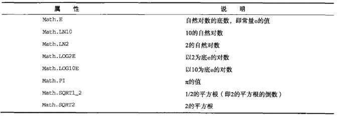
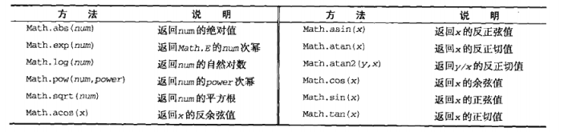

# LearnJavaScript

# 1 单体内置对象

ECMA-262 规定了内置对象："由ECMAScript提供，不依赖宿主环境的对象，在ECMAScript 程序执行前就已经存在了"
内置对象：Object、Array和String....
单体内置对象：Global 和 Math

## 1.1 Global 对象

不属于任何其他对象的属性和方法，都是Global对象的属性和方法；所有在全局作用域中定义的属性和函数，都是Global对象的属性，但是不管是以什么角度去看，Global对象都是不存在的，但是通过window对象就可以使用Global对象的属性和方法

### 1.1.1 Global 对象的一些方法

1） URI 编码方法

encodeURI() || encodeURIComponent() || decodeURI() || decodeURIComponent()

用于对URI进行编码，以便发送给浏览器，有效的URI不能包含某些字符；
通过UTF-8 编码替换掉无效的字符，从而让浏览器能够接收和理解；

encodeURI -- 主要应用于整个URI 不会对于URI本身的特殊字符进行编译，只有空格被替换成%20；
encodeURIComponent -- 主要应用于URI的片段 对于整个URI的特殊字符进行编译
decodeURI -- 进行encodeURI 相反的操作
decodeURIComponent -- 进行encodeURIComponent 相反的操作

```
var u = 'https://www.lagou.com/resume/my resume.html'
console.log(encodeURI(u)); // https://www.lagou.com/resume/my%20resume.html
console.log(encodeURIComponent(u)); // https%3A%2F%2Fwww.lagou.com%2Fresume%2Fmy%20resume.html
```

由于一般用于对查询字符串进行编译，所以常使用 `encodeURIComponent`

>注：
>URI是一个用于标识某一互联网资源名称的字符串。 该种标识允许用户对任何（包括本地和互联网）的资源通过特定的协议进行交互操作。URI由包括确定语法和相关协议的方案所定义。格式： "协议://域名/目录a/文件D"；
>URI方法能够编译所以 Unicode 的字符；

2) eval()

会将eval传入的字符串当做实际的ECMAScript语句来解析，然后将执行结果插入的原位置；

>注：
>1. eval 转的变量或者函数，不会存在变量提升
>2. eval 十分危险，使用时要注意被注入代码

3) Global 对象的属性


4) window 对象

ECMAScript 中没有指出如何直接访问Global对象，但是提供了window对象，而Global就作为window对象的一部分实现；所以Global的所有属性都可以在window中找到；

## 1.2 Math 对象
[DOME2](./html/dome2.js)
### 1.2.1 Math 对象的属性



### 1.2.2 Math 对象的方法

1) min() 与 max()

```
Math.min(number, number ....):number
Math.max(number, number ....):number
```

```
var mi = Math.min(1,2,1,3,21,32);
console.log(mi); // 1
var mx = Math.max(1,2,1,23,123,12);
console.log(mx); // 123
```

可以通过apply的方法，找到数组的最大或者最小值；
```
var arr = [1,22,1,22,33,12]
var mi2 = Math.min.apply(Math,arr)
var mi3 = Math.max.apply(Math,arr)
console.log(mi2); // 1
console.log(mi3); // 33
```

2) 舍入方法

Math.ceil() || Math.floor() || Math.round()

Math.ceil() --- 向上取整
Math.floor() --- 向下取整
Math.round() --- 四舍五入

3) 随机

Math.random()

实例： 去任意区间内的随机数
```
function limitRandom (min, max){
    var l = max - min + 1;
    return Math.floor(Math.random() * l + min);
}

var num = limitRandom(10, 20)
console.log(num);
```

注: l --- 区间内的可以的值的总数；

实例： 与数组配合，随机去除数组中的某一项

```
var color = ['red','black','yellow','blue'];
function arrRandom (arr) {
    return arr[limitRandom(0, arr.length-1)]
}
var colorR = arrRandom(color)
console.log(colorR);
```

4) 其他方法



这些都是常有方法；
