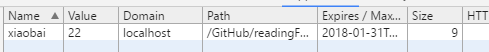

# Learn JavaScript

# 1. 离线应用和客户端存储

离线 web 应用，是 web 应用的一个重点；

## 1.1 离线检测

- navigator.onLine

HTML5 提供了一个 navigator.onLine 属性，这个属性返回一个布尔值表示是否可以上网；
可以使用下面的方式进行测试
```
if (navigator.onLine) {
    alert('能够上网')
} else {
    alert('不能')
}
```

实际测试，这个值并不准确，在chrome下这个值始终为true
>注：在 MDN 查找后，发现是由于电脑中存在虚拟网卡（我的是猎豹wifi）；但是同时也指出了这个属性并不能准确的反应出是否在线。

- window.online && window.offline

```
window.addEventListener('online', function () {
    alert('链接上了网络')
})
window.addEventListener('offline', function () {
    alert('退出了网络')
})
```

经过测试，必须使用事件绑定的形式才会生效

## 1.2 应用缓存

HTML5 的应用缓存是专门为开发离线web应用设计的，通过描述文件列出要下载和缓存的资源；但是应用缓存较为复杂，暂不做详细介绍；

## 1.3 数据储存

<!-- 在服务器环境下使用 -->

### 1.3.1 cookie

Http Cookie -- cookie, 保存在本地，然后当对应的网址访问的时候，将这件信息发送回服务端

cookie 实质上是绑定在特定的域名下的，当设置了一个 cookie 后，再给它的域名发送请求的时候，都会包含这个 cookie 。

限制：

1. 每个域能存放的cookie的总数是有限的，并且各个浏览器之间各有不同
2. 浏览器中对于 cookie 的尺寸也是有限制的，尺寸限制会影响到一个域下的所有 cookie

### 1.3.2 cookie 的构成

cookie 由以下部分构成

1. 名称 -- 一个唯一确定的 cookie 的名称
2. 值 -- 储存在 cookie 中的字符串值，必须被 URL 编码
3. 域 -- 所有向该域发送的请求中都会包含这个 cookie 信息
4. 路径 -- 可以指定，有那个路径下的文件可以访问 cookie
5. 失效时间 -- 表示 cookie 何时应该被删除的时间戳（默认是在回话结束的时候立即删除）
6. 安全标志 -- 指定后，cookie 只有在使用 SSL 连接的时候才发送到服务器

在 Http 请求头中的 Set-Cookie 中设置

### 1.3.3 JavaScript 中的 Cookie

 `document.cookie` 来操作 cookie ，这个接口会根据使用方式的不同表现出不同的行为

- 设置cookie

`document.cookie = "name=ff"`

>注：虽然通过这种方式可以设置cookie, 但是这是由于‘name’和‘ff’是需要编码的，但是在设置 cookie 的时候，最好键和键值都需要通过 `decodeURIComponent()` 来编译成URL编码
通过`decodeURIComponent`可以设置一个新的 cookie 字符串，这个字符串会被解释并且添加到现有的 cookie 集合中，

`document.cookie = "decodeURIComponent('name') + '=' + decodeURIComponent('ff')"`

如果是需要设置其他参数通过字符串拼接

### 1.3.4 封装 Cookie 相关工具

基本的 cookie 操作包括三种行为：读取、写入、删除

[DOME3](./dome/dome3.html)

```
var CookieUtil = {
    get: function(name) { // 读取
        var cookieName = encodeURIComponent(name) + '=',
            cookieStart = document.cookie.indexOf(cookieName),
            cookieValue = null;

        if (cookieStart > -1) {
            var cookieEnd = document.cookie.indexOf(';', cookieStart);
            if (cookieEnd == -1) {
                cookieEnd = document.cookie.length;
            }
            cookieValue = decodeURIComponent(document.cookie.substring(cookieStart +
                cookieName.length, cookieEnd));
        }
        return cookieValue;
    },
    set: function(config) {
        var settings = {
            name: '', // name
            value: '', // value
            expires: '', // 路径
            path: '', // 域
            domain: '', // 失效日期
            secure: '' // 安全标示
        }
        for (var item in config) {
            if (config.hasOwnProperty(item)) {
                settings[item] = config[item]
            }
        }
        var cookieText = encodeURIComponent(setting.name) + '=' +
            encodeURIComponent(setting.value);

        if (setting.expires instanceof Date) {
            cookieText += '; expires=' + setting.expires.toGMTString();
        }

        cookieText += '; path=' + setting.path + '; domain' + setting.domain +
            '; secure' + setting.secure;

        document.cookie = cookieText;
    },

    unset: function(config) {
        this.set(config)
    }
}
```

使用示例：
```
CookieUtil.set({
    name: 'xiaobai',
    value: '22',
    expires: new Date(2018,01,01)
})

CookieUtil.unset({
    name: 'name'
})
```

显示为：



### 1.3.5 子 cookie

再浏览器中cookie 存在数量限制，提出了子cookie的概念；
子cookie就是通过特殊的格式，在一个cookie中存放多个cookie的信息，例如：
`name=name1=value&name2=value2&name3=value3`

这种储存的方式肯定是通过特殊的读取方式进行操作

[DOME4](./dome/dome4.html)


```
var SubCookieUtil = {
    get: function(name, subName) {
        var subCookies = this.getAll(name);
        if (subCookies) {
            return subCookies[subName];
        } else {
            return null
        }
    },
    getAll: function(name) {
        var cookieName = encodeURIComponent(name) + '=',
            cookieStart = document.cookie.indexOf(cookieName),
            cookieValue = null,
            cookieEnd,
            subCookies,
            i,
            parts,
            result = {};

        if (cookieStart > -1) {
            cookieEnd = document.cookie.indexOf(';', cookieStart);
            if (cookieEnd == -1) {
                cookieEnd = document.cookie.length
            }
            cookieValue = document.cookie.substring(cookieStart +
                cookieName.length, cookieEnd);

            if (cookieValue.length > 0) {
                subCookies = cookieValue.split('&');

                for (var i = 0; i < subCookies.length; i++) {
                    parts = subCookies[i].split('=');
                    result[decodeURIComponent(parts[0])] =
                        decodeURIComponent(parts[1]);
                }
                return result;
            }
        }
        return null;
    },
    set: function(config) {
        var settings = {
            name: '',
            subName: '',
            value: '',
            subCookies: {}
        }
        for (var item in config) {
            if (config.hasOwnProperty(item)) {
                settings[item] = config[item]
            }
        }
        settings.subCookies = this.getAll(settings.name) || {};
        settings.subCookies[settings.subName] = settings.value;
        this.setAll(settings)
    },
    setAll: function(config) {
        var settings = {
            name: '',
            value: '',
            expires: '',
            path: '',
            domain: '',
            secure: '',
            subCookies: {}
        }
        for (var item in config) {
            if (config.hasOwnProperty(item)) {
                settings[item] = config[item]
            }
        }
        var cookieText = encodeURIComponent(settings.name) + '=',
            subCookieParts = new Array(),
            subName;
        for (var subName in settings.subCookies) {
            if (settings.subCookies.hasOwnProperty(subName) && subName.length > 0) {
                subCookieParts.push(encodeURIComponent(subName) + '=' +
                    encodeURIComponent(settings.subCookies[subName]));
            }
        }
        if (subCookieParts.length > 0) {
            cookieText += subCookieParts.join('&');
            if (settings.expires instanceof Date) {
                cookieText += '; expires=' + settings.expires.toGMTString();
            }
            if (settings.path.length) {
                cookieText += '; path=' + settings.path;
            }
            if (settings.domain.length) {
                cookieText += '; domain=' + settings.domain;
            }
            if (settings.secure.length) {
                cookieText += '; secure=' + settings.secure;
            }
        } else {
            cookieText += ';expires=' + (new Date(0)).toGMTString()
        }
        document.cookie = cookieText;
    },
    unset: function(name, subName) {
        var subCookies = this.getAll(name);
        if (subName) {
            delete subCookies[subName];
            this.setAll({
                name: name,
                subCookies: subCookies
            });
        } else {
            this.unsetAll(name)
        }
    },
    unsetAll: function(name) {
        this.setAll({
            name: name,
            expires: new Date(0)
        })
    }
}
```

使用示范：

```
SubCookieUtil.set({
    name: 'people',
    subName: 'xiaobai',
    value: '22',
    expires: new Date(+new Date + 10000)
})

SubCookieUtil.setAll({
    name: 'people',
    subCookies: {
        'con1': 1,
        'con2': 2
    },
    expires: new Date(+new Date + 10000)
})

SubCookieUtil.unset('people', 'con1')

SubCookieUtil.unset({
    name: 'con'
})

var a = SubCookieUtil.getAll('people', 'con2')
console.log(a);
```

>注：使用子cookie的时候，一定要注意cookie的长度

### 1.3.6 关于cookie的思考

还有一类cookie 叫做HTTP专有cookie，可以通过浏览器或者服务器设置，但是只能在服务器中读取；

在使用cookie的时候一定要注意：
1. 由于所有的cookie都是浏览器作为请求头进行发送，所以cookie中存储大量信息会影响到特定区域的请求性能，cookie存储的信息越大，完成服务器请求的时间就会越长
2. cookie 数据并非储存在一个安全的环境中，重要的信息不要通过cookie进行储存

## 1.4 Web 存储机制

Web Storage 是 HTML5 中的一部分，Web Storage 的目的是克服由 cookie 带来的一些限制，当数据需要被严格控制在客户端上时，无需持续地将数据发回服务器；

Web Storage 具有两个目的：
1. 提供cookie之外的储存会话数据的途径
2. 提供一种存储大量可以跨会话存在的数据的机制

### 1.4.1 Storage 类型

Storage 类型提供最大的存储空间(根据浏览器而定)来存储名值对，Storage 的实例与其他对象类似，有以下方法：
1. clear() 删除所有值；火狐没有实现
2. getItem(name) 获取name的keyValue
3. key(index) 获取index位置的key
4. removeItem(name) 删除name的键值对
5. setItem(name, value) 建立name-value的键值对

注：
- Storage 类型只能储存字符串，如果不是字符串的数据在储存之前就会被转换成字符串
- Storage 建议使用方法而不是属性来访问数据

### 1.4.2 sessionStorage 对象

sessionStorage 对象存储特定会话的数据，也就是说这个数据只能保存到浏览器关闭；存储在 sessionStorage 中的数据可以跨越页面刷新而存在，同时如果浏览器支持，在浏览器崩溃并重启之后依旧可以访问；

特点：
1. 只能由存储这项数据的页面才可以访问；
2. sessionStorage 对象绑定于某个服务器，所以当文件在本地运行的时候是不可用的；
3. sessionStorage 是 Storage 的一个实例；

存储：

```
//使用方法储存
sessionStorage.setItem('key', 'value')
// 使用属性储存
sessionStorage[key] = 'value'
// 使用方法读取数据
sessionStorage.getItem('key')
// 使用属性读取数据
sessionStorage[key]
```

可以通过 length 属性 和 key() 方法来迭代 sessionStorage 中的值，也可以通过 for-in 循环来迭代；如果需要删除数据，可以使用 delete 操作符，或者是 removeItem() 的方法

### 1.4.3 localStorage 对象

`localStorage` 对象在修订过的 HTML5 规范中作为之久保存客户端数据的方法；

如果要访问 `localStorage` 页面必须来自同一个域名(子域名无效)，使用同一中协议，在同一个端口；

由于 `localStorage` 是 Storage 的实例，所以可以像使用 `sessionStorage` 一样来使用它。

```
//使用方法储存
sessionStorage.setItem('key', 'value')
// 使用属性储存
sessionStorage[key] = 'value'
// 使用方法读取数据
sessionStorage.getItem('key')
// 使用属性读取数据
sessionStorage[key]
```

储存在`localStorage` 的数据将会保留到 通过 JavaScript 删除或者是用户清除浏览器缓存

## 1.5 Storage 事件

在修改 Storage 对象的时候，都会在文档上触发 storage 事件，当通过属性或者 setItem() 方法保存数据，使用 delete 或者是 removeItem() 删除数据，或者调用 clear() 方法的时候，就会触发；

但是在目前 storage 事件支持性不好；

## 1.6 限制

web Storage 对象也同样具有限制，因浏览器而异，一般来说对储存空间大小的限制都是以每个来源（协议，端口，域）为单位。
对于 `localStorage` 来说，大多数桌面浏览器限制为5M 但是对于chrome 和 Safari 来说，每一个来源的限制为 2.5M

对于 `sessionStorage` 来说，有的浏览器没有大小限制，基于 webkit 的浏览器限制在 2.5M，而在 IE8+ 和 opera 来说 `sessionStorage` 的限制为 5M

## 1.7 IndexedDB - 数据库

由于对于数据库，暂时没有接触过，没看懂，暂不错记录；
