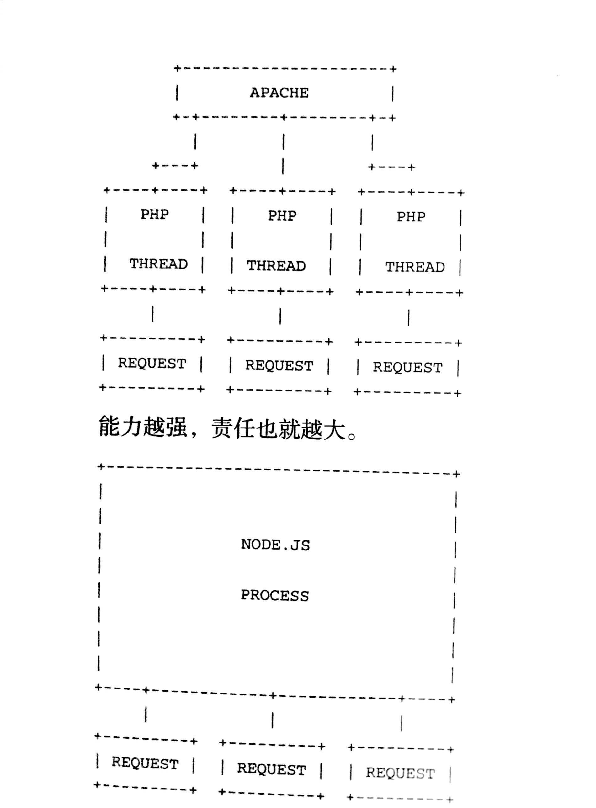
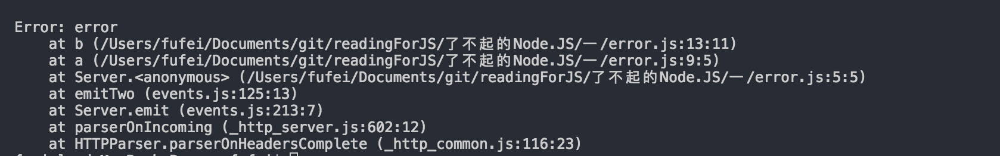
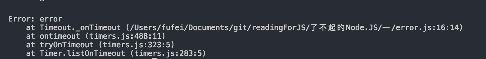

# nodeJs 前言

<!-- TOC -->

- [nodeJs 前言](#nodejs-前言)
    - [1. NodeJs 简介](#1-nodejs-简介)
        - [1.1 安装](#11-安装)
        - [1.2 Node REPL](#12-node-repl)
        - [1.3 执行文件](#13-执行文件)
        - [1.4 NPM](#14-npm)
    - [2. JavaScript 概览](#2-javascript-概览)
        - [2.1 简介：](#21-简介)
        - [2.2 JavaScript 语言基础](#22-javascript-语言基础)
        - [2.3 V8 中的 JavaScript](#23-v8-中的-javascript)
    - [3. 阻塞与非阻塞IO](#3-阻塞与非阻塞io)
        - [3.1 能力越大责任越大：](#31-能力越大责任越大)
        - [3.2 阻塞](#32-阻塞)
        - [3.3 单线程事件](#33-单线程事件)
        - [3.4 错误处理](#34-错误处理)
        - [3.5 堆栈追踪](#35-堆栈追踪)

<!-- /TOC -->

## 1. NodeJs 简介

### 1.1 安装

官网下载安装不必细说，只有在 Linux 下需要使用命令行进行安装稍微麻烦一些，但是也可以到时再做研究，这里并不细说；

可以通过使用 `node -v` 查看版本号，从而可以来判断是否已经安装；

### 1.2 Node REPL

nodeREPL -- node 程序

要运行 nodeREPL 仅仅只需要再终端中输入 node 即可，我们可以在 node 中运行 JavaScript ，并且可以对代码进行补全，可以作为备用的代码提示工具；(滑稽)

### 1.3 执行文件

和其他的脚本语言相同，nodejs 可以通过 node 命令来执行 node 脚本例如：

1. 创建一个 web-server.js 文件, 输入：

        ```js
            var http = require('http');
            var serv = http.createServer(function (req, res){

                res.writeHead(200, ({'Content-Type': 'text/html'}));
                res.end('hello node, hello new world');
            });
            serv.listen(3000);
        ```
1. 在终端找到文件所在路径，并运行文件，开启服务器，输入命令 node <文件名>；

    `node web-service.js`

1. 在浏览器中访问 `localhost:3000` 就可以看到 `hello node, hello new world` 文字；

### 1.4 NPM

NPM 是 包管理工具，用于进行模块管理，可以下载制定的包并处理包的的依赖关系，运行测试脚本以及安装命令行脚本；

NPM 的安装同样十分简单，目前会随着 node 一同安装，不多叙述；
可以使用 npm --version 来判断 npm 是否已经安装

NPM 应该属于一个较为独立的知识，不仅仅局限在 node.js，整个说起来内容还是比较多的，这里仅仅只做介绍：

- npm publish -- 发布一个包
- npm init -- 创建项目
- package.json 为配置文件，main 指定入口文件
- npm help json 来查看关于 package.json 的相关说明
- npm search <关键字> 查找包
- npm view <包名称> 查看包的相关信息

有的项目是分发 node 编写的命令行工具，安装是就要全局安装 -g；发布时通过 json 中的 bin 字段来指向脚本或者是二进制文件的所在位置，使用时可以直接在终端输入命令；

## 2. JavaScript 概览

### 2.1 简介：

    JavaScript 三大特点：基于原型、面向对象以及动态脚本；

JavaScript 是根据 ECMAScript 标准来实现的，而由于 Node 基于 V8 的原因，所以 Node 同样也十分接近于标准，另外 Node 提供了一些标准之外的附加功能；（注意他们仅仅只采用了同一套标准，所以不能将 NodeJs 和 JavaScript 混为一谈）

### 2.2 JavaScript 语言基础

这里仅仅对 JavaScript 进行简单的介绍；

1. 类型

    基础类型 & 复杂类型  
    基础类型访问的是值，而复杂类型访问的是对值得应用，也就是我们常说的址；  
    基本类型包含：number、boolean、string、null、undefined  
    复杂类型：array、function、object  

1. 类型判断

    常用方法：typeof、instanceof、object.prototype.toString.call();

    typeof -- 简单判断，只能区分 number、 string、 undefined、 boolean、 function 和 Object；  
    instanceof -- 判断前者是不是在后者的原型链中；  
    object.prototype.toString.call() -- 通过查看对象内部的[[Class]] 的值，这个值本身是不可变的，这种判断方式最为可靠;  
    例如：`console.log(Object.prototype.toString.call(a)); // [object Object]` 

1. 函数

    在 JavaScript 中，函数属于一等公民，具有十分重要的地位;  
    由于函数本质上是对象 `console.log(b instanceof Object); //true`，所以同样可以作为参数进行传递；

    JavaScript 中所有的函数都可以进行命名，包括自执行函数; 但同时由于函数并不在其实位置，所以并不会被识别成为一个函数声明，因此在调用的时候回显示 `is not defined`;

        ```js
            // step2
            var b = function name(){console.log('hi');};
            console.log(b instanceof Object); //true
            b(); // hi
            try {
                name(); // name is not defined
            } catch (e) {
                console.log(e)
            }

            (function name1(){
                console.log('my name is name1');
            })();

            try {
                name1();
            } catch (error) {
                console.log(error); //name1 is not defined
            }
        ```

* 1. This、Function.call()、Function.apply()

    通过 call 和 apply 可以修改 function 中的 this 的指向；  
    
    区别：
        call -- 修改 this 指向，并执行；传递一个个的传递  
        apply -- 修改 this 指向；可以使用数组，来表示参数

1. 函数的参数数量

    函数有一个很有意思的属性：参数数量 -- length;  
    该属性指明函数声明的时候，可以接受的参数数量，在 JavaScript 中，该属性名为 length；
    
        ```js
            var c = function (a, b, c) {

            };

            console.log(c.length); // 3
        ```

1. 闭包
    在当前执行环境下，创建一个新的执行环境的方法叫做闭包，闭包内部可以沿着作用域链向上查找到外部作用域，反之不行；  
    常见用于通过自执行函数，创建一个新的作用域从而产生私有变量；

1. 类
    在 ES6 之前，JavaScript 并没有类的概念（ES6 后也仅仅是模拟了类的概念），类只能通过函数构建，如果需要对每一个实例添加函数，只能通过 new 以及原型链的概念来实现；

        ```js
            function Animate(){};
            Animate.prototype.say = function (){
                console.log('my name is Animate');
            };

            var a = new Animate();
        ```
    这里又出现了一个常见问题，new 操作符，做了什么事情  

    1. 在函数的内部作用域中，创建了一个对象，然后将内部作用域，挂在这个对象下
    1. 运行代码
    1. 将这个对象 return 出去，并在内部销毁    

1. 继承
    在 JavaScript 中，继承应该是一个比较独特的概念；

        ```js
            function Animate (name){
                this.name = name;
            }

            Animate.prototype.say = function (){
                console.log(this.name);
            }

            function AnimateSon (sonName){
                Animate.call(this, sonName);
            }

            AnimateSon.prototype = new Animate();

            var getFn = new AnimateSon('ff');
            getFn.say(); // ff
        ```
    这个就是最为便捷的继承方式；但是存在问题，就是每一次对于原构造函数都要运行一次（我们仅仅需要集成他的原型，而不想对对象进行初始化），可以有两种方式继续优化；

    一：
    
        ```js
            function Animate (name){
                if (arguments[0] === 'inherit') return;
                this.name = name;
            }

            Animate.prototype.say = function (){
                console.log(this.name);
            };

            function AnimateSon (sonName){
                Animate.call(this, sonName);
            }

            AnimateSon.prototype = new Animate('inherit');

            var getFn = new AnimateSon('ff');
            getFn.say(); // ff
        ```
    二：

        ```js

            Animate.prototype.say = function (){
                console.log('ff');
            };

            function  emptyFn() {}

            emptyFn.prototype = new Animate();
            function AnimateSon (sonName){
            }

            AnimateSon.prototype = new emptyFn();

            var getFn = new AnimateSon();
            getFn.say(); // ff
        ```
    
    整个过程并不难理解，不做细说；

1. try {} catch（）{}
    try/catch -- 错误捕获，上面的实例中就存在这个行为，在 try 中出现的错误，并不会是代码停止运行，而是将错误信息传入到 catch 中，作为参数；
    catch 中是独立的作用域；

### 2.3 V8 中的 JavaScript

了不起的 NodeJS 一书，关于 V8 中的 JavaScript 许多都已在浏览器中实现；

1. Object / keys

    通常我们在遍历一个对象的使用会使用下面的方法；

        ```js
            var a = {name: 'ff', age: '24'};
                for (var key in object) {
                    if (object.hasOwnProperty(key)) {
                        var element = object[key];
                        
                    }
                }
            }
        ```

    - 住：hasOwnProperty -- 用于判断 key 是不是 Object 自身的属性，如果不做判断使用 forin 就会将原型链上的属性也遍历出来；
    
    在新的表中中可以通过 `Object.keys` 来获取对象的 key 值；

        ```js
            {
                var a = {name: 'ff', age: '24'};
                for (var key in a) {
                    if (a.hasOwnProperty(key)) {
                        var element = a[key];
                        
                    }
                }

                var arr = Object.keys(a);
                console.log(arr); // ['name', 'age']
            }
        ```

1. Array.isArray

    `Array.isArray([])` // true;

1. 数组方法
    forEach / filter / map  
    
        ```js
            var arr = ['a','b','c','d'];
            arr.forEach(function (v,i){
                console.log(v, i);
            });
            // v -- value i -- index

            {
                // 返回满足条件项的组成的数组
                var arr = [1,21,2,32];
                var newArr = arr.filter(function (v){
                    return v > 10;
                });
                console.log(newArr); // [21, 32]
            }
            {
                // map -- 运行每一项，并将返回值组成数组
                var arr = [1,2,3];
                var newArr = arr.map(function (v){

                    return v + 10;
                });
                console.log(arr, newArr);
            }
        ```
    
1. 字符串方法

    string.trim（） -- 去除前后空格；

1. JSON

    JSON.stringify || JSON.parse

1. bind

    function.bind(this, [])

1. function.name

    - 注：对自执行的函数，或者函数声明，对函数添加 name 就能够更好的追踪代发错误位置；

1. \_\_proto\_\_

    _\_proto__ 使得定义继承链变得更加容易
    z
        ```js
            function Animate (){}
            function AnimateSon(){}

            Animate.prototype.say = function (){
                console.log('use proto');
            };

            AnimateSon.prototype.__proto__ = Animate.prototype;

            var a = new AnimateSon();
            a.say(); // use proto
        ```

1. 存取器

    你可以通过调用方法来定义属性，访问属性通过 `__defineGetter__`、设置属性就是用 `__defineSetter__`
    - 注： 在规范中已经禁止了这两个定义属性的方式，应为使用 Object.defineProperty() 是一个更好的方式；详情请看：[Object.defineProperty](https://developer.mozilla.org/en-US/docs/Web/JavaScript/Reference/Global_Objects/Object/defineProperty)

- __总结：__  
    由于本书出版已经是很久以前的事情了，所以有些知识已经产生了变化，JavaScript 在浏览器中对标准的支持性也有了很大的提升；但是和 NodeJS 相比，NodeJS 在对规范的支持性上更加出色；

## 3. 阻塞与非阻塞IO

### 3.1 能力越大责任越大：

在 NodeJS 中，存在一个复杂的概念：共享状态的并发；所以你需要对回调函数如何修改当前内存中的变量特别小心；简单的说，NodeJS 采用了一个长期运行的进程，相反，Apache 会产生多个进程（每一个请求一个线程），每次都会刷新状态，在 PHP 中，当解释器再次执行的时候，变量会被重新的赋值，而在 Node 中，函数会被再次调用，但是变量的状态并不会重新赋值，而是和上一个行为共享状态；   
例如：



### 3.2 阻塞

在了解 Node 的非阻塞行为前，我们需要先了解什么是阻塞和事件轮询；  
简单的说，阻塞就是当代码在运行的过程中，被阻拦下来，只用上一个行为完全结束以后才能执行下一个行为，这种方式又称为同步；  
事件轮询，就是现将事件注册，然后不停的询问内核这些事件是否已经分发，当事件发生的时候，对应的回调函数就会被触发，然后继续执行下去如果事件没有发生，就继续执行下面的代码；  

NodeJS 的一个重要特点就是高并发性，而 NodeJS 的并发实现就采用了事件轮询；

### 3.3 单线程事件

单线程就是一次只能执行一件事情，当执行一个函数的时候，整个代码就会被阻塞住，并等待上一个函数的运行， JavaScript 就属于是单线程的运行方式，但是这种方式并不理想，JavaScript 通过异步回调的方式合理的分配工作；  

简单的说：今天上午需要等待到 8 点才能出门，如果你选择坐在门口什么都不做一直等到 8点，这种行为就属于单线程阻塞行为，如果你决定等个闹钟，然后去吃饭，当闹钟响起的时候再去出门，这就属于单线程非阻塞异步回调；如果你选择一遍吃饭、一遍看书的坐在门口等待，这就属于多线程行为；需要注意的是，如果你吃饭吃到一半了，闹钟响了，那么也会等到吃饭饭后在去出门；所以通过单线程异步回调，并不能保证你一定可以在 8点钟 准时出门；

Node 已经支持多线程的运行方式；

### 3.4 错误处理

NodeJS 应用依托于一个拥有大量共享状态的大进程中，所以如果某一个回调行为中发生了错误，就会导致整个进程崩溃；

### 3.5 堆栈追踪

```js
    var http = require('http');

    http.createServer(function (){

        a()
    }).listen(3000);

    function a (){
        b();
    }

    function b(){
        throw new Error('error')
    }
```

在终端开启服务，然后访问 localhost：300； 程序报错，进程崩溃  
我们可以看到这段代码的堆栈追踪信息，
;  
可以看到首先冲函数 b 开始出现错误，从而影响到一系列的行为，最终导致进程崩溃；

但是如果使用事件轮询的方式就无法产生追踪，对于一个未来发生的异步回调行为也是同理；  

可以看到这里仅仅是出现了一个错误信息 -- Timeout; 并不能追踪到他的运行函数；

在 Node 中许多像 http net 这样的原声模块都会分发 error 事件，如果对于 error 没有进行处理就会排除未捕获的错误;
常用的处理方式也是比较多的：

```js
    process.on('uncaughtException', function (error){
        console.log(error);
    });
```

这些行为都说明了，在 NodeJS 要每一步都对错误进行谨慎的处理，如果遗漏了，一旦发生就会导致错误难以追踪；