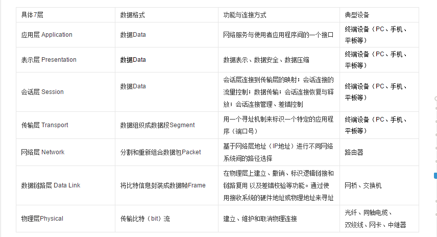
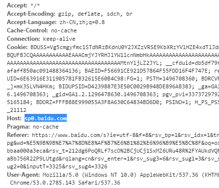
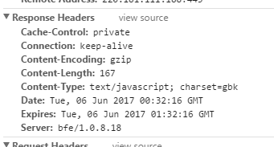

# Web 全栈工程师的自我修养

    作者：雨果
    2015-09

* 什么是全栈工程师
* 如何成为全栈工程师
* 从学生到工程师
* 野生程序员
* 工程师事业指南

## 什么是全栈工程师

全栈 -- Full Stack
全栈表示为了完成一个项目，所需要的一系列技术的集合

如果需要开发一个 Web 页面，通常需要掌握的知识有：

1. 服务器 -- 常见的有 Linux
2. 数据库 -- MySQL
3. 服务器端编程语言 -- PHP
4. 前端标记语言和脚本语言 -- HTML、JavaScript

这些技术组合在一起就可以看做是 web 栈；

* __那么什么是全栈工程师呢？__

    对于什么是全栈工程师，在业界并没有严格的定义，但是存在一个这样的观点：一个能够处理数据库、服务器、系统工程和客户端的所有工作的工程师。并且能够根据需求不同，实现移动栈、Web栈、或者原生的应用栈；总的来说就是一个可以独立完成一个产品的工程师；

    如果单指 Web 全栈工程师，那么就应该是指可以独立构建网址的工程师

* __大公司的 Web 开发流程__

    随着互联网的快速发展 web 开发，也越来越复杂，一个好的开发流程应该包含下面几个方面；
    产品经理 => 交互设计 => 视觉设计 => 前端开发 & 后台开发 => 测试 => 发布

    每一个阶段都对应着自己的工作职能：

    1. 产品经理
        产品经理是一个对产品的策划一直到发布都起着重要作用的管理者；包括制定产品规划，协调资源，把控方向等等；
    2. 交互设计
        交互设计的主要任务是优化用户界面信息分布和操作流程
    3. 视觉设计
        视觉设计是在交互设计产出的框架上完成视觉上的润色和设计
    4. 开发
        * 前端开发
            前端工程师负责还原设计稿并实现交互设计，前端工程师需要掌握的知识有：HTML/CSS/JavaScript 以及性能、语义化、多浏览器兼容、SEO、自动化工具等知识
        * 后端开发
            后端工程师负责使用服务器语言，进行服务器开发，在小的公司里可能还会负责服务器的配置和调试（运维工程师）以及数据库的配置和管理（数据库管理员）等工作
    5. 测试工程师
        测试工程师保证产品的可用性

* __Web 开发也是软件开发__

    我们先看一看 App 栈的组成：
    1. 服务器 -- 常见的有 Linux
    2. 数据库 -- MySQL
    3. 服务器端编程语言 -- PHP
    4. IOS 或者 Android 技术开发

    我们可以看到 App 栈和 Web 栈的差别，仅仅在于客户端的载体不同；他们都是软件开发，它的架构方式是类似的：服务器端接收数据和发送数据，客户端处理数据以及交互行为；

    服务端和客户端通过 HTTP 协议传递信息。而 HTTP 具有通用性，所以一套后台开发技术，可以为所有的前端展现方式实现软件的商业逻辑；

    如果服务器技术和客户端技术分离得当，后台技术就可以和前台技术随意搭配；

* __新的技术栈__

    上面提到了一种目前常见的 Web 技术栈 -- LAMP (Linux(服务器) -- Apache(服务器软件) -- MySQL(数据库) -- PHP(服务端开发语言))
    目前还存在一个具有代表性的框架：MEAN (MonagoDB(NoSQL类型的数据库) -- Express(NodeJs 框架) -- AnglarJS(JS框架，主要用于开发富交互的单页面应用程序) -- NodeJs (一个运行在服务器端的 JavaScript 运行环境，并且能在本机运行))

* __学习理念__

    我常常把学习比作一棵树，树叶漂亮，但是总是会飘落的，树枝茂密，但是总是摇摆不定，而只有粗壮树干才能承受住各种问题，如果你想快速实现功能，就去学习树叶，如果你想熟练输出功能，那就去学习树枝，如果你想枝繁叶茂，就要去学习树干，这些行为没有什么好与坏的区别适合就好；

全栈工程师并不是要追求在各个技术上都达到高级工程师的地步，因为接触更多的技术分散的尽力也多，到头来可能一事无成；如果想在各个领域中都有建树，首先就要具备坚实的基础能力，以及开阔的眼界，然后在以本专业的技术为主向外去辐射性的学习，达到一转多能的地步；

全栈所需要的知识储备并不是一个短时间就可以达到的，这个过程需要长期积累，需要不断在解决问题的过程中积累知识和经验；

技术的目的是为了解决问题：所以建议不要醉心于新的技术，在学习一个新的技术之前，最好问问自己，它是为了解决什么问题而存在的，它的优势在哪里，我学习它的目的是什么；在遇到一个新的技术的时候我们要时刻保持冷静，不可以盲目的学习；

## 如何成为全栈工程师

成为一个全栈工程师必然是一个漫长的过程，我们需要长时间的积累知识，并且要在积累的过程中保持一定的原则；

* __先精后广，一专多长__
    现在一个特定的方向上深入研究，然后在将学习的目标渐渐的推广开来；

    1. 以前端为例：
        基础的：HTML、CSS、JavaScript;
        进阶：性能优化、SEO、多种框架、响应式页面等
        扩展：服务器端语言、APP 方向

    一个专精的知识点，更有利于求职，而懂得多却没有一个特色，那也就是刚好满足要求的普通人；

* __扩展知识__
    如果你想成为一个全栈工程师，在满足基本需求的时候，就需要扩展你的知识储备，需要寻找合适的技术开始入手；

    1. 围绕着商业目标
        技术服务于商业，在考虑做什么项目的时候应该围绕着商业利益作为目标；

        从商业的角度考虑，一个好的高级开发者应该可以做到：1. 减少成本，比如加快内部系统的运行速率，让产品的制作流程更加的顺利；2. 增加收入，比如：让用户更加容易的购买产品，或者提高服务质量；

        一个团队的管理制度，需要做的事情有很多，比如：从诸多事情中找到最具有商业价值的一个；

        * 注：
            1. 永远要从商业的角度来决定学习那些知识，而不是纯粹的为了锻炼技术能力而去学习；
            2. 始终关注问题，而不要将注意力全部放在解决问题的工具上；

    2. 关注用户体验

        * 从用户的角度考虑问题；
        * 所有的优秀的工程师都是所做的一切都是为了优化用户体验；
        * 所有你服务的对象都是你的客户，包括上游的设计师和下游的后台工程师；
        * 一些东西看似笨拙，但是能够很好的满足用户需要，那么这就是好的东西；

## 从学生到工程师

这一节，主要讲的是作者根据经验对刚刚毕业的大学生，如何通过简历、作品等方式找到一份满意的工作，以及在实习的过程中如何表现自己；

* 注：
    1. 简历要具有突出点，不重要的东西不要写；
    2. 实习要常常记录以及总结

## 野生程序员

野生程序员主要是指通过兴趣进入到这个行业中的人；也许野生程序员可以做到从前台到后台一手包揽，但是很可能在各个方面都不精通；
作者从 Web 性能、HTTP协议等方面入手讲述了，一个野生程序员的可能具有的缺点

* 性能优化：
    1. 压缩源码和图片
        js 采用混淆压缩的方式，css 进行普通压缩； JPG 采用具体质量要求进行压缩，PNG使用一些开源压缩软件进行压缩；
    2. 选择合适的图片
        颜色数多的使用 JPG，如果能够通过服务器判断浏览器支持 WebP，就使用 webp 格式和 SVG 格式；
    3. 使用服务端 Gzip 压缩
        主要是压缩一些文本文件
    4. 使用 CDN
        使用一些公开库或者第三方提供的静态地址，这样可以达到公用缓存，增加并发下载数；
    5. 延长静态资源的缓存时间
        要注意修改文件名，让用户能够拉到最新的资源；
    6. 将 css 放在页面的头部，js 放在页面的尾部
        这样就不会阻塞页面渲染

* 建议：
    1. 在保持知识的广度的同时，要做到一专多精；
    2. 大公司好；

## 工程师事业指南

这一节，讲了如何积累声望

1. 遇事要实事求是，对问题不了解的时候，不要擅自下判断，并且要懂得合理的拒绝别人，如果接受了一个任务却完成不了，不管原因如何都会损害自己的声望；
2. 积累作品
    一个好的作品能帮助我们很多，这个作品不仅仅是指你的工作项目，也可以是自己的个人项目，在开始制作个人作品前，一定要先明确这个作品的目标客户是谁？它的目的是什么？  
    * 注：
        1. 如果每次签入的代码，都比签出的代码要好，那么整个代码就会越来越好，所以不要担心代码不够好而畏手畏脚；
        2. 好的开源的作品，能够提升自己的声望，能够吸引到一部分人共同优化，并且可以在别人提出的 issue 中提升自己，也不要因为自己的代码不够好而不开源；
    * 补充：
        1. 设计师网站：[dribbble](https://dribbble.com/)

3. 静态页面（GitHub Pages）
    GitHub 不仅仅提供了代码托管的服务，并且还提供了 GitHub pages 功能，它允许我们在用户或者项目的主页创建一个页面；
    [创建GitHub Pages](https://pages.github.com/)

    GitHub 和 Jekyll
    Jekyll 可以将用户编写的 Markdown 格式的内用，快速编译成为一个完整的静态页面，
    [Jekyll](http://jekyll.com.cn/)


4. 突出重点
    如果你的作品中有一些动态的内容的话，可以选择自己架设服务器并绑定域名，VPS就是一个很好的选择，但是这个是收费的；
    任何一个作品都要有自己的特点，目的以及面向的对象；然后根据这些特性去构建并完善；

## 全栈工程师眼中的 HTTP

HTTP （HyperText Transfer Protool, HTTP）超文本传输协议，是目前互联网上应用最为广泛的一种网络协议，设计 HTTP 协议的最初目的是提供一种发布和接受 HTML 页面的方法

1. HTTP 简介
    OSI （开放式系统互联参考模型）定义了整个世界计算机互相连接的标准，总共分为 7 个层次；HTTP、HTTPS、FTP、SSH 等都属于应用层；HTTP 协议，规定只要其下的协议能够提供可靠的传输就可以被其使用

    

    1. 关于 HTTP 版本
        HTTP 采用向下兼用的方式；有客户端将它采用的协议版本号在请求开始的时候告诉服务器，后者在相应的时候采用相同或更早的协议服务；
    
    2. 示例：

        下面是一个 HTTP 客户端与服务器之间回话的实例：

            ```js
                GET/ HTTP/1.1 
                HOST: www.google.com
            ```
        这是一个简化后的例子，包含了请求方式，协议版本号和资源路径，下面是在百度搜索的时候发出的完整请求头；

        

        服务器随之应答：

        
    
    3. 前端眼中的 HTTP

        我们可以在浏览器中观察到 HTTP 请求的相关信息；
        比如：  
            * 每个请求的开始时间
            * 每个请求花费的时间
            * 每个请求的类型
            * 每个请求的状态码
            * 每个请求的流量消耗
            * 每个请求的 GZIP 压缩前的体积，以及解压后的体积

        目前最基本的优化方法就是：1. 减小同一域名下的 HTTP 请求；2. 减少资源体积；

        1. 减少同一域名下的 HTTP 请求
            浏览器常常限制了同一域名下的并发连接数的上限，所以我们需要减少 HTTP 请求次数，从而加快加载速度；
            由于浏览器是根据资源的域名限制并发连接数，而不是针对浏览器的页面域名，所以很多静态资源可以放在其他的域名下（不同的子域名，也算），这样就可以突破浏览器的并发数量的限制，但是要注意服务器的压力；

            将静态文件放到非主域名下，不但可以增加并发请求数，而且可以减少不必要的 cookie 信息的传输，我们在请求同一域名下的文件的时候，都会携带这个域名下的 cookie 信息，但是如果访问的是静态文件，就可以省略掉 cookie；

            我们还可以通过合并文件来减少请求次数，但是如果合并的文件太大又会降低体验，需要权衡

            我们还可以省略不必要的 HTTP 请求，比如：嵌套小型的 JS/CSS、设置缓存，减少重定向。
        
        2. 尽量减少每一个资源的体积
            使用 gzip 进行压缩，gzip 对于含有重复 “单词” 的文本文件，压缩率非常高，能够有效的提高传输的速度；
    
    4. 后台眼中的 HTTP
        后台关注点在于如何让服务器尽快的响应，以及减小请求对服务器的开销；
        
        浏览器限制并发数，其实是对服务器的一种保护，如果通过产生了大量的 HTTP 请求，可能会导致浏览器崩溃；比如：一些下载软件，它作为一个 HTTP 协议下的客户端，不考虑服务器的压力，而发起大量请求；所以通常会被服务器‘防范’

        * 为什么服务器对并发请求这么敏感?
            由于在单核 CPU 架构的服务器中，会将多个程序在同一时间加载到储存器中，而计算机对于生成进程，处理进程，销毁进程会十分的消耗 CPU 以及内存，所以在负载高的时候会降低性能；
        
        * 提高服务器的请求能力
            在 Linux 2.4 之前进程是基本运作单位，而在 Linux 2.6 之后线程是基本的运作单位，而进程是线程的一个容器；线程具有开销小，部分资源共享，效率高等优点；

            Apache 是市场份额最大的服务器，Apache 利用模块化来处理多请求，其中有一个模块叫做多处理模块 MPM，专门用来处理多请求的情况，默认的 MPM 是 prefork，为了优化我们可以选择 worker 模式；

            prefork 是一个进程维持一个连接，而 worker 是一个线程维持一个连接，所以 worker 在内存使用中更具优势，所以更适合处理高并发的情况；但是 worker 在稳定性上不如 prefork，因为一个线程出错整个进程都会死掉；

            近年来，Nginx（服务器） 由于轻量、处理请求是异步非阻塞方式的特点，在处理高并发请求的时候能保持低资源、低消耗。高性能，所以十分适合处理高并发请求的情况；

            由于 Nginx 和 Apache 各有特点，所以通常会使用 Nginx 处理前端并发，而使用 Apache 处理后端请求；

            值得一提的是，Node.js 也是异步非阻塞的方式处理请求，所以在高并发请求上具有天然的优势；
        
        * DDoS 攻击
            DDoS -- 分布式拒绝服务攻击（TCP/IP 类型的攻击）；
            简单来说就是黑客入侵并控制了大量用户的计算机，然后在这些计算机上安装了 DDoS 软件，而每一个 DDoS 攻击客户端都可以自由设置 TCP/IP 并发连接数，并且链接上服务器后，它不会断开链接，而是保持这个链接一段时间，直到同时链接的数量大于最大连接数，才断开之前的数量；

            通过这种方式，持续保持链接的数量，让服务器瘫痪无法响应正常用户的请求，从而达到攻击的效果；

            对于这种攻击，并没有好的防护方法，除了增加贷款，和提高服务器的处理的最大链接数，另一种方法就是首页静态化，DDoS 攻击者喜欢攻击对服务器进行写操作的页面，这样请求数会更高，服务器会更加容易宕机。而静态页面会服务器压力小，而且能够部署到 CDN 上；
